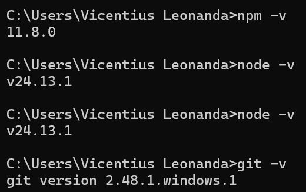
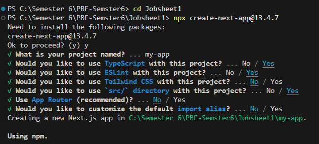
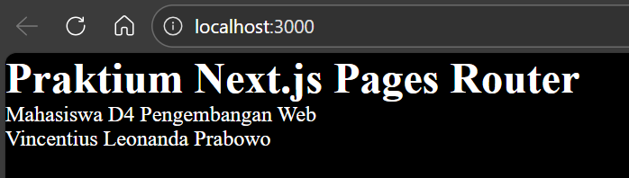
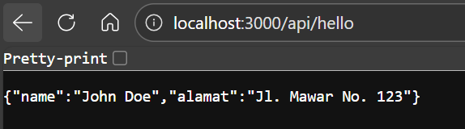
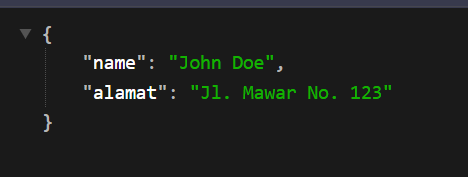
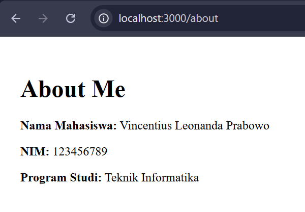
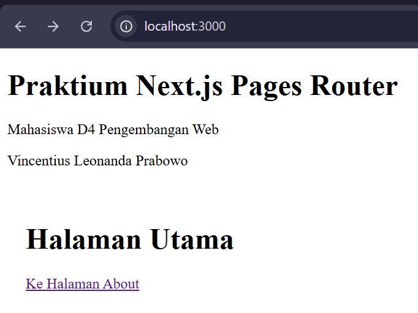

# Laporan Praktikum Jobsheet 04

## Identitas

- **Mata Kuliah**: Pemrograman Berbasis Framework
- **Program Studi**: Teknik Informatika
- **Semester**: 6
- **Praktikum**: Jobsheet 01 - Setup Project Next.js menggunakan Pages Router
- **Nama**: Vincentius Leonanda Prabowo
- **NIM**: 2341720149
- **Kelas**: TI-3D

---

## Lankah 1 - Pengecekan Lingkungan

## Langkah 2 - Membuat Project Next.js

## Langkah 3 - Menjalankan Server Deployment

## Langkah 5 - Modifikasi Halaman Utama

## Langkah 6 - Modifikasi API

## Langkah 7 - Modifakasi Background

## Tugas 1

## Tugas 2

## Pertanyaan Refleksi

### 1. Mengapa Pages Router disebut routing berbasis file?

Pages Router disebut routing berbasis file karena sistem routing ditentukan dari nama dan lokasi file di dalam folder `pages/`.  
Contoh:

- `pages/index.js` → `/`
- `pages/about.js` → `/about`  
  Tidak perlu konfigurasi routing manual.

---

### 2. Apa perbedaan Next.js dengan React standar (CRA)?

- **Next.js**: Framework React yang memiliki routing otomatis, SSR, SSG, dan optimasi bawaan.
- **React (CRA)**: Hanya menyediakan dasar React, perlu tambahan library untuk routing atau fitur lainnya.

---

### 3. Apa fungsi `npm run dev`?

Menjalankan aplikasi dalam mode development dan membuka server lokal (biasanya `localhost:3000`) dengan fitur auto-reload.

---

### 4. Apa perbedaan `npm run dev` dan `npm run build`?

- `npm run dev` → Untuk pengembangan (coding & testing).
- `npm run build` → Membuat versi produksi yang sudah dioptimalkan.
