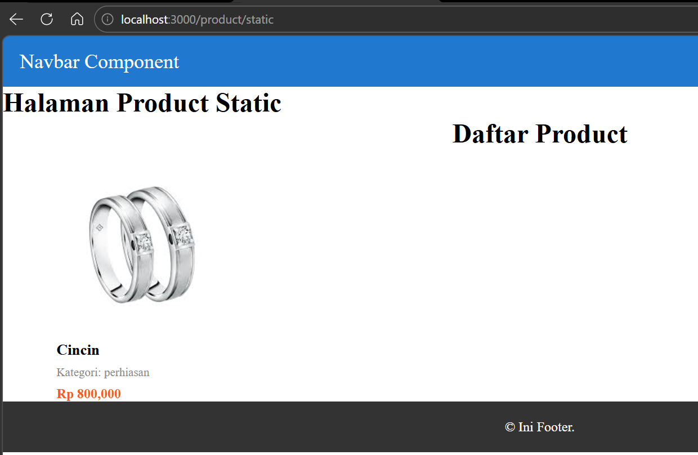
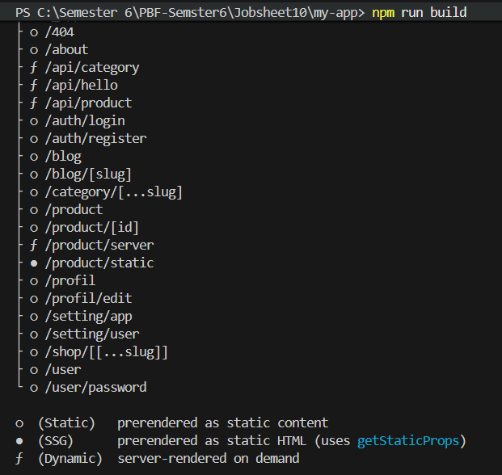
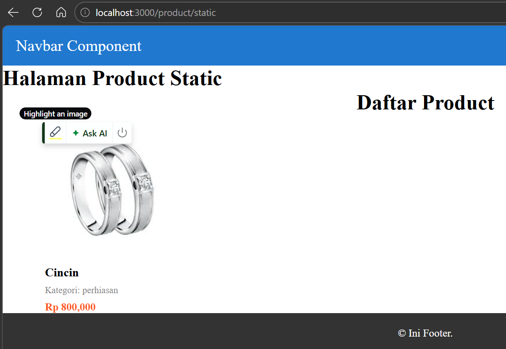
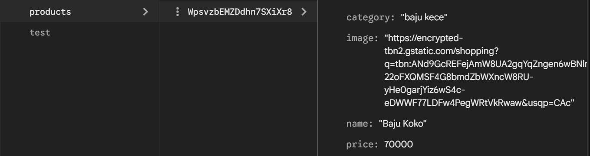
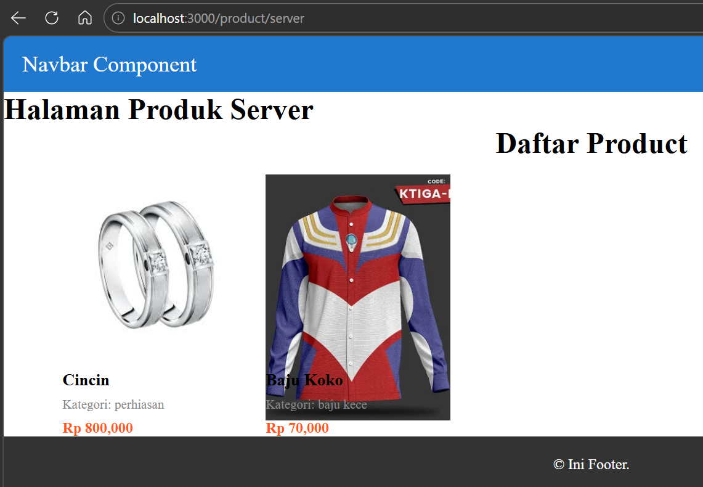
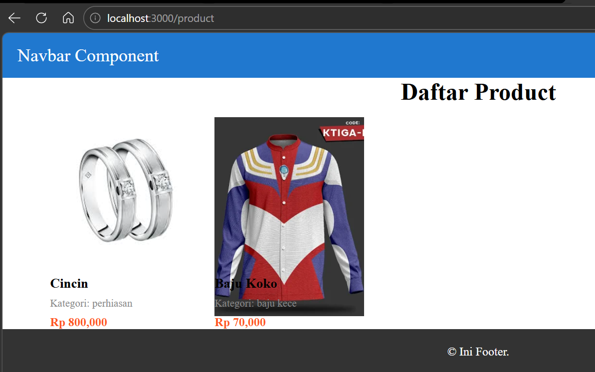
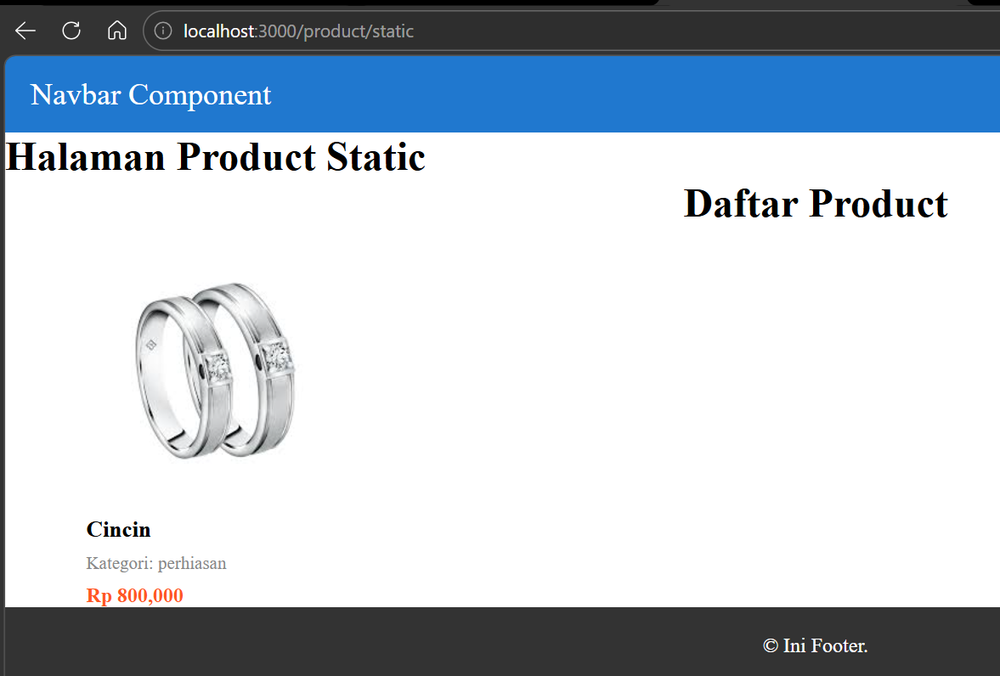
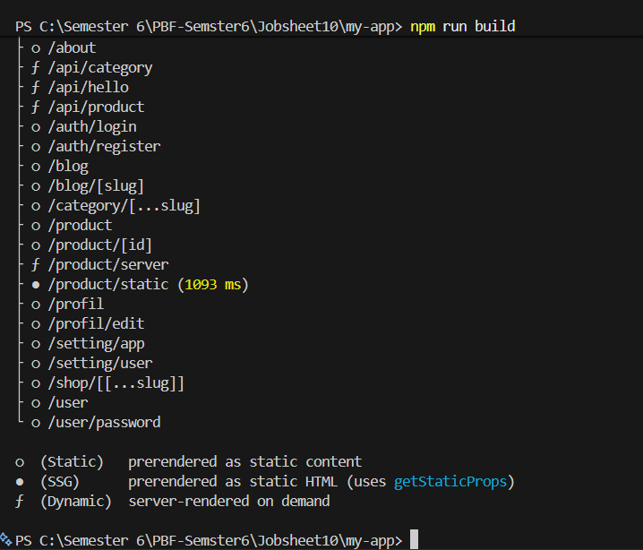
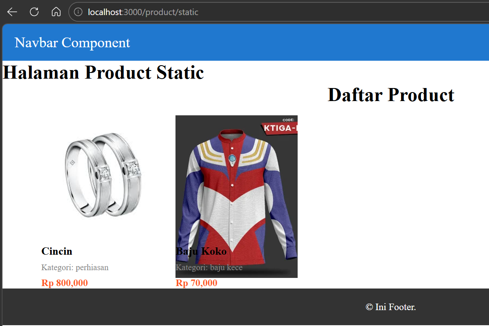
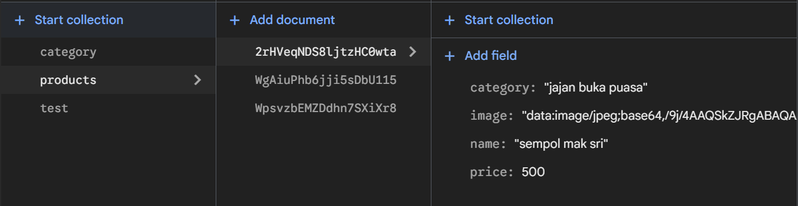

# Laporan Praktikum Jobsheet 10

## Identitas

- **Mata Kuliah**: Pemrograman Berbasis Framework
- **Program Studi**: Teknik Informatika
- **Semester**: 6
- **Praktikum**: Jobsheet 10
- **Nama**: Vincentius Leonanda Prabowo
- **NIM**: 2341720149
- **Kelas**: TI-3D

## Langkah 1 Setup Halaman Static

## Langkah 3 Build Production Mode

### Berhasil Menjalankan npm run build

### Berhasil Menjalankan npm run start

## Langkah 4 Pengujian Perubahan Data (1)

### Menambahkan Data Firebase

### SSR Product Bertambah

### CSR Product Bertambah

### SSG Tidak Berubah

## Langkah 4 Uji 2
### Build Ulang

### SSG Berubah
\

## Tugas Individu
### Halaman SSR SSG CSR

### UJI

### Pembahasan: Dari uji yang dilakukan pada SSG harus melakukan build dulu baru data bisa muncul, berbeda dengan SSR dan CSR.

## Pertanyaan :

## 1. Mengapa SSG tidak menampilkan data terbaru?

Karena **SSG (Static Site Generation)** mengambil data saat proses **build** saja.
Setelah website dibangun, halaman menjadi **file statis**, sehingga data tidak akan berubah sampai dilakukan **build ulang**.

---

## 2. Mengapa SSG lebih cepat?

SSG lebih cepat karena halaman sudah dibuat menjadi **HTML statis saat build**, sehingga server tidak perlu memproses data lagi ketika ada pengguna yang membuka halaman.

---

## 3. Kapan SSG tidak cocok digunakan?

SSG tidak cocok digunakan ketika:

* Data sering berubah
* Membutuhkan data **real-time**
* Konten berbeda untuk setiap pengguna (personalized content)

---

## 4. Mengapa e-commerce tidak cocok menggunakan SSG murni?

Karena pada **e-commerce**, data seperti:

* stok barang
* harga produk
* jumlah produk tersedia

sering berubah. Jika menggunakan SSG murni, perubahan tersebut **tidak langsung terlihat** sampai website di-build ulang.

---

## 5. Apa perbedaan build mode dan development mode?

### Development Mode

* Digunakan saat proses **pengembangan**
* Perubahan kode langsung terlihat
* Tidak dioptimasi untuk performa

### Build Mode

* Digunakan untuk **production**
* Website dioptimasi agar lebih cepat
* Halaman statis dibuat saat proses build

