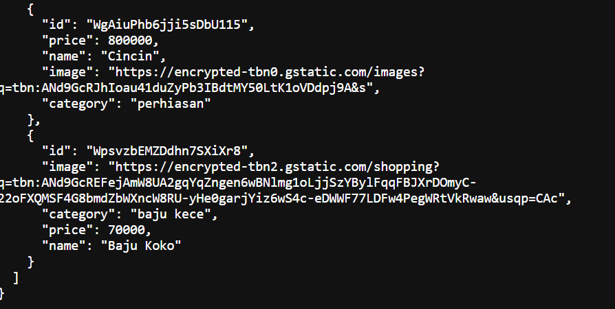
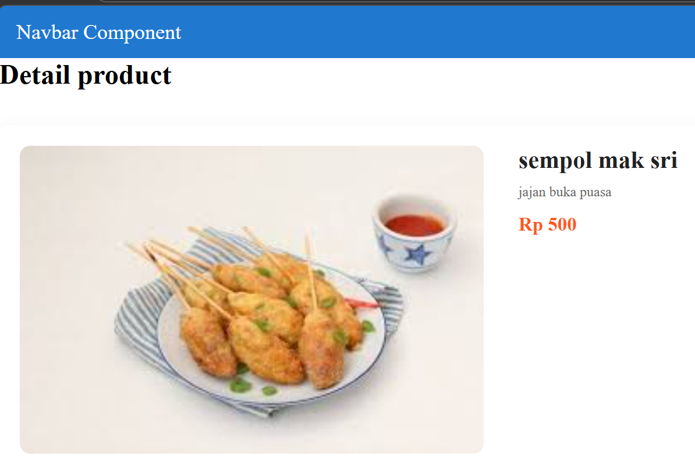
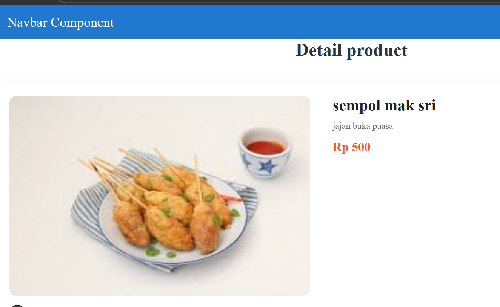
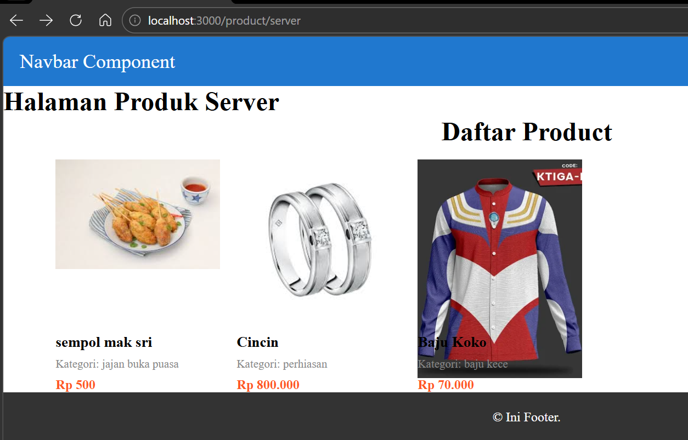
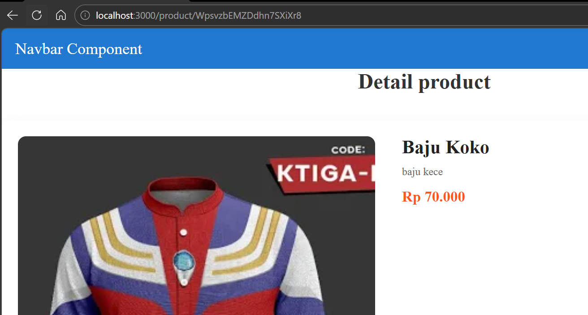

# Laporan Praktikum Jobsheet 11

## Identitas

- **Mata Kuliah**: Pemrograman Berbasis Framework
- **Program Studi**: Teknik Informatika
- **Semester**: 6
- **Praktikum**: Jobsheet 11
- **Nama**: Vincentius Leonanda Prabowo
- **NIM**: 2341720149
- **Kelas**: TI-3D

## Langkah 1 Membuat Dynamic Route

## Langkah 2 Implementasi CSR (Client Rendering)

## Langkah 3 Implementasi SSR

