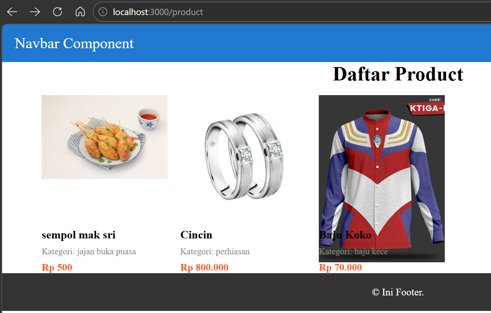
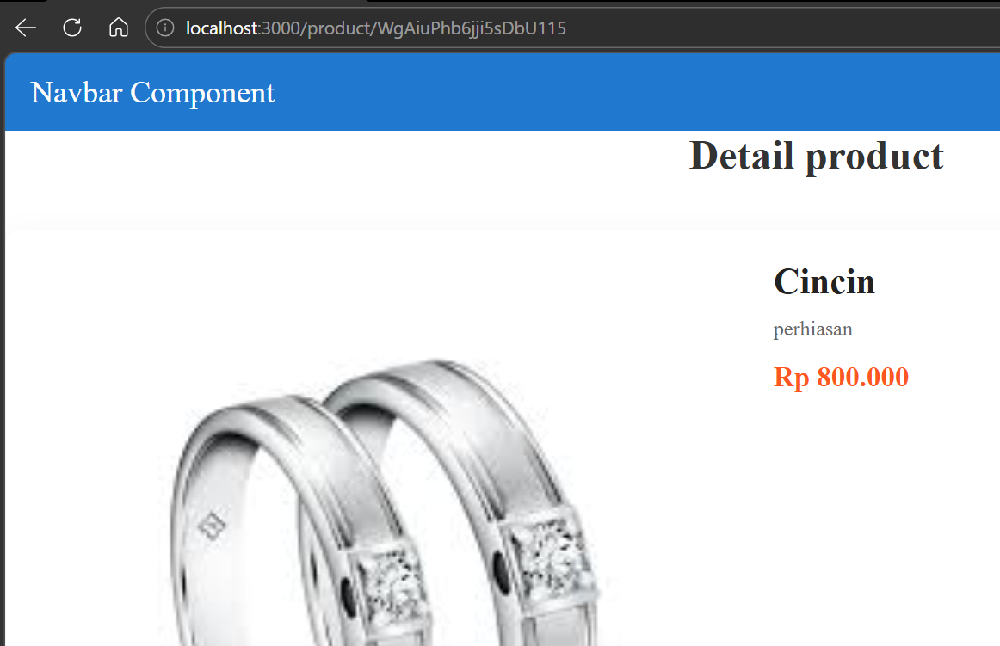

# Laporan Praktikum Jobsheet 11

## Identitas

- **Mata Kuliah**: Pemrograman Berbasis Framework
- **Program Studi**: Teknik Informatika
- **Semester**: 6
- **Praktikum**: Jobsheet 11
- **Nama**: Vincentius Leonanda Prabowo
- **NIM**: 2341720149
- **Kelas**: TI-3D

## Langkah 1 Membuat Dynamic Route

## Langkah 2 Implementasi CSR (Client Rendering)

## Langkah 3 Implementasi SSR

## Langkah 4 Implementasi SSG

## Tugas = Praktikum

## Pertanyaan Analisis

1. **Mengapa getStaticPaths wajib pada dynamic SSG?**  
   Karena `getStaticPaths` digunakan untuk menentukan halaman dynamic mana saja yang harus dibuat saat proses build.

2. **Mengapa CSR membutuhkan loading state?**  
   Karena data diambil dari server setelah halaman dimuat sehingga perlu menampilkan status loading saat menunggu data.

3. **Mengapa SSG tidak menampilkan produk baru tanpa build ulang?**  
   Karena halaman SSG dibuat saat build sehingga data baru tidak muncul sampai dilakukan build ulang.

4. **Mana metode terbaik untuk halaman detail e-commerce?**  
   Metode terbaik biasanya **SSR atau ISR** karena dapat menampilkan data terbaru tanpa harus build ulang seluruh website.

5. **Apa risiko menggunakan SSG untuk produk yang sering berubah?**  
   Risikonya adalah informasi produk bisa menjadi tidak terbaru karena halaman dibuat hanya saat proses build.
