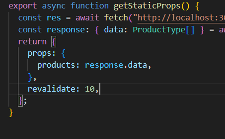
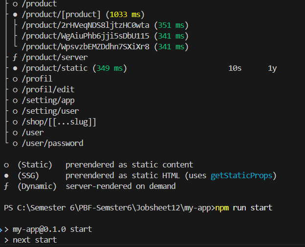
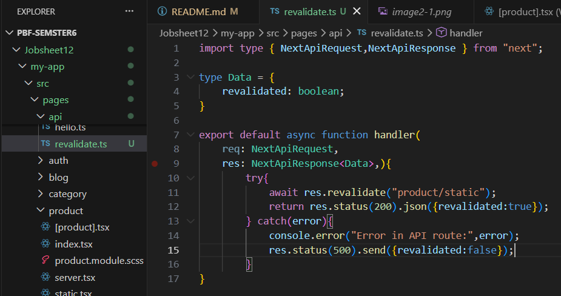
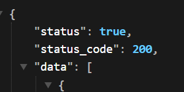

# Laporan Praktikum Jobsheet 12

## Identitas

- **Mata Kuliah**: Pemrograman Berbasis Framework
- **Program Studi**: Teknik Informatika
- **Semester**: 6
- **Praktikum**: Jobsheet 12
- **Nama**: Vincentius Leonanda Prabowo
- **NIM**: 2341720149
- **Kelas**: TI-3D

## Langkah 1 Tambahkan revalidate

## Langkah 2 Pengujian ISR

### hasil

## Langkah 3 On Demain Revaliation
1. Buat API Revalidate

2. Tambahkan Parameter Data

