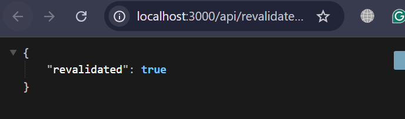
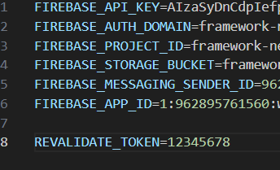

# Laporan Praktikum Jobsheet 12

## Identitas

- **Mata Kuliah**: Pemrograman Berbasis Framework
- **Program Studi**: Teknik Informatika
- **Semester**: 6
- **Praktikum**: Jobsheet 12
- **Nama**: Vincentius Leonanda Prabowo
- **NIM**: 2341720149
- **Kelas**: TI-3D

## Langkah 1 Tambahkan revalidate

## Langkah 2 Pengujian ISR

### hasil

## Langkah 3 On Demain Revaliation
1. Buat API Revalidate

2. Tambahkan Parameter Data

3. Tambahkan Token Security

## Langkah 4 Pengujian Manual Revalidation

## Pertanyaan
### H. Pertanyaan Analisis

**1. Mengapa ISR lebih fleksibel dibanding SSG?**
ISR lebih fleksibel karena halaman yang sudah dibuat secara statis masih bisa diperbarui tanpa harus melakukan build ulang seluruh aplikasi. Dengan ISR, data dapat diperbarui secara otomatis ketika ada perubahan sehingga website tetap cepat tetapi datanya tetap relatif terbaru.

**2. Apa perbedaan revalidate waktu dan on-demand?**
Revalidate waktu memperbarui halaman secara otomatis setelah waktu tertentu yang sudah ditentukan. Sedangkan on-demand revalidate dilakukan secara manual melalui API ketika ada perubahan data.

**3. Mengapa endpoint revalidation harus diamankan?**
Endpoint revalidation harus diamankan agar tidak sembarang orang dapat memicu proses pembaruan halaman. Jika tidak diamankan, server bisa dibanjiri permintaan revalidate yang dapat mengganggu kinerja aplikasi.

**4. Apa risiko jika token tidak digunakan?**
Jika token tidak digunakan, siapa pun dapat mengakses endpoint revalidation dan memicu pembaruan halaman. Hal ini dapat menyebabkan penyalahgunaan sistem dan meningkatkan beban server secara tidak perlu.

**5. Kapan ISR lebih cocok dibanding SSR?**
ISR lebih cocok digunakan ketika data tidak berubah setiap saat tetapi tetap perlu diperbarui secara berkala. Dengan ISR, website tetap cepat seperti halaman statis namun masih dapat menampilkan data yang cukup terbaru.

