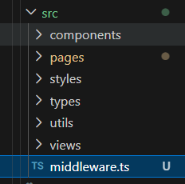
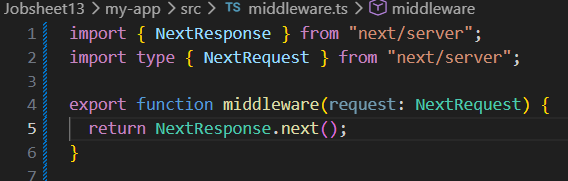
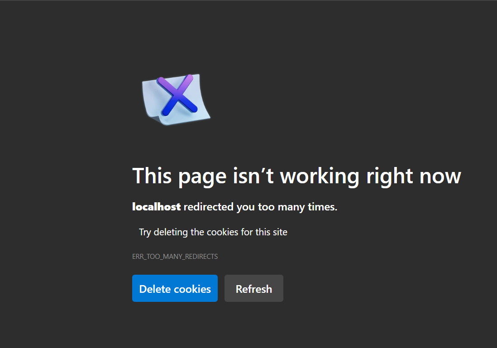
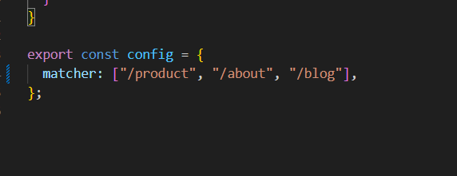

# Laporan Praktikum Jobsheet 13

## Identitas

- **Mata Kuliah**: Pemrograman Berbasis Framework
- **Program Studi**: Teknik Informatika
- **Semester**: 6
- **Praktikum**: Jobsheet 13
- **Nama**: Vincentius Leonanda Prabowo
- **NIM**: 2341720149
- **Kelas**: TI-3D

## Langkah 1 Membuat Middleware

## Langkah 2 Struktur Dasar Middleware

## Langkah 3 Redirect Sederhana

## Langkah 4 Batasi Route Tertentu

### Ket: Halaman Lain tetap normal, hanya halaman about dan product yang redirect

## Langkah 5 Simulasi Sistem Login

## UJI
### KET: saat flase 3 halaman ini tidak bisa terbuka dan saat true kebalikkannya

## Pertanyaan

1. Middleware lebih aman dibanding useEffect karena berjalan di server sebelum halaman ditampilkan ke user.

2. Middleware tidak menimbulkan glitch karena proses pengecekan dilakukan sebelum halaman dirender.

3. Jika semua halaman diproteksi tanpa pengecualian, user bisa terjebak redirect dan tidak bisa membuka halaman apa pun.

4. Middleware tidak diperlukan jika halaman tidak membutuhkan autentikasi atau pengecekan akses.

5. Middleware digunakan untuk memproses request sebelum halaman dibuka, sedangkan API route digunakan untuk membuat endpoint backend yang mengirim atau memproses data.

