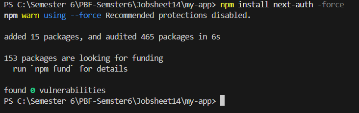
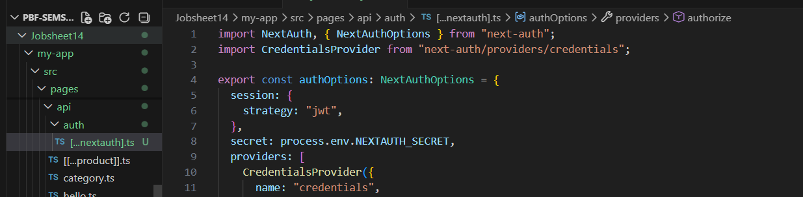
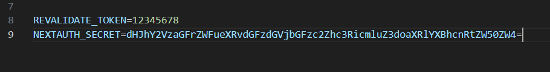
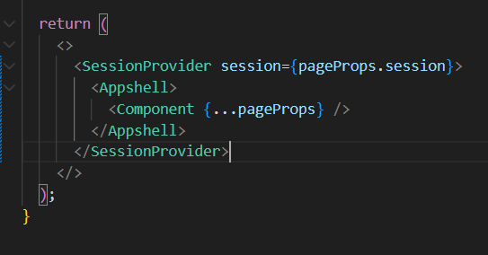
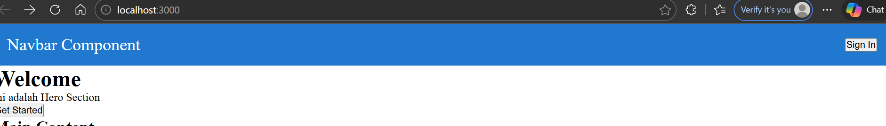
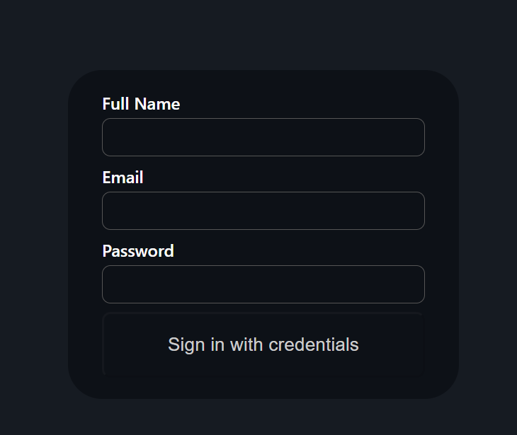
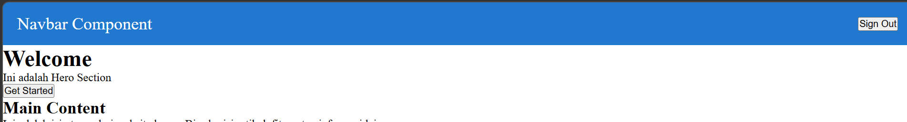
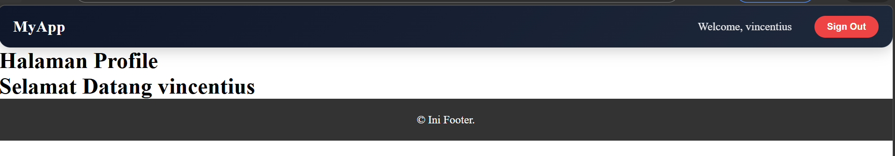

# Laporan Praktikum Jobsheet 14

## Identitas

- **Mata Kuliah**: Pemrograman Berbasis Framework
- **Program Studi**: Teknik Informatika
- **Semester**: 6
- **Praktikum**: Jobsheet 14
- **Nama**: Vincentius Leonanda Prabowo
- **NIM**: 2341720149
- **Kelas**: TI-3D

## Langkah 1 Install Next AUth

## Langkah 2 Konfigurasi API Auth

## Langkah 3 Tambahkan Secret

## Langkah 4 Tambahkan Session Provider

## Tambahkan Tombol Login dan Logout

## Menambahkan Data Tambahan

## Proteksi Halaman Profil

