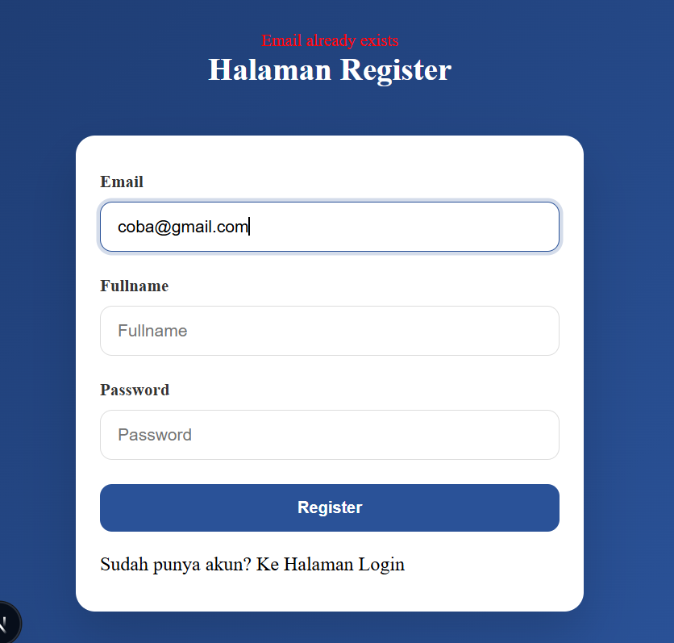
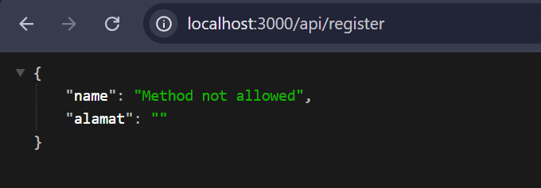
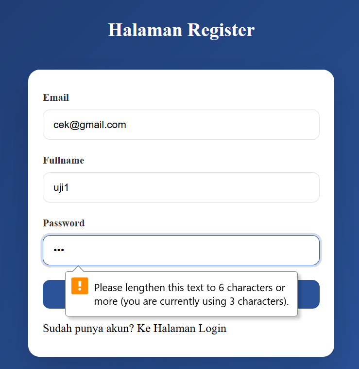
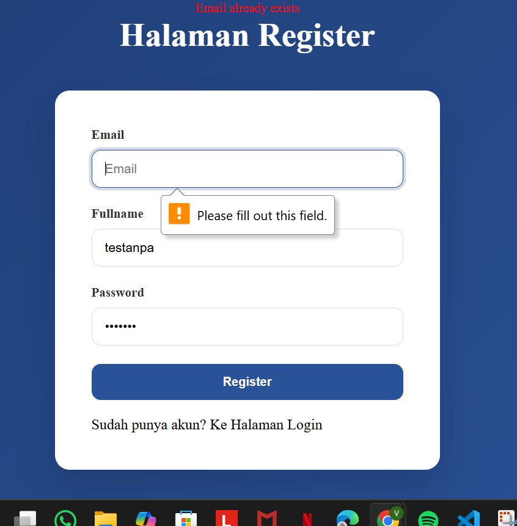
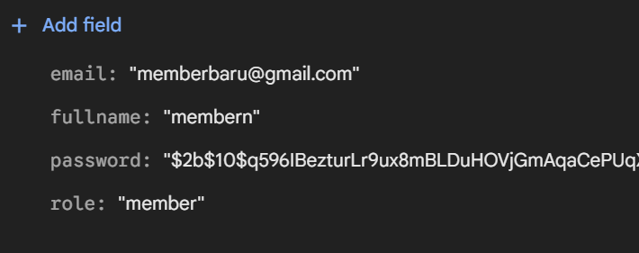

# Laporan Praktikum Jobsheet 15

## Identitas

- **Mata Kuliah**: Pemrograman Berbasis Framework
- **Program Studi**: Teknik Informatika
- **Semester**: 6
- **Praktikum**: Jobsheet 15
- **Nama**: Vincentius Leonanda Prabowo
- **NIM**: 2341720149
- **Kelas**: TI-3D

## Langkah 1 Membuat Regiter View

## Langkah 2 Membuat API register

## Langkah 3 Install brcypt

### ERROR

## UJI 1 Register Baru

## UJI 2 Email sudah ada

## Uji 3 Method Get

## Tugas

1. Saya sudah melakukannya sama seperti praktikum sebelumnya 
    

2. Membuat validasi email dan password 
     
   

3. Member 
    
4. UJI  
   

## Pertanyaan

1. **Mengapa password harus di-hash?**
   Password di-hash untuk menjaga keamanan agar tidak tersimpan dalam bentuk asli (plain text), sehingga jika database bocor, password tetap tidak bisa dibaca.

2. **Apa perbedaan addDoc dan setDoc?**

- `addDoc` → menambahkan data dengan ID otomatis
- `setDoc` → menambahkan/mengganti data dengan ID yang ditentukan sendiri

3. **Mengapa perlu validasi method POST?**
   Untuk memastikan endpoint hanya menerima request yang sesuai (misalnya POST untuk register) dan mencegah akses yang tidak diinginkan.

4. **Apa risiko jika email tidak dicek unik?**
   Bisa terjadi duplikasi akun dengan email yang sama, menyebabkan kebingungan, error login, dan masalah keamanan.

5. **Apa fungsi role pada user?**
   Role digunakan untuk membedakan hak akses user, misalnya admin dan member, sehingga setiap user hanya bisa mengakses fitur tertentu sesuai perannya.
