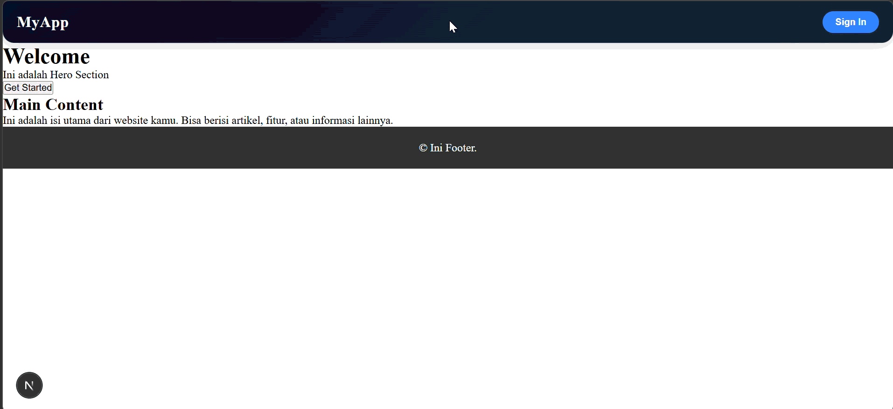
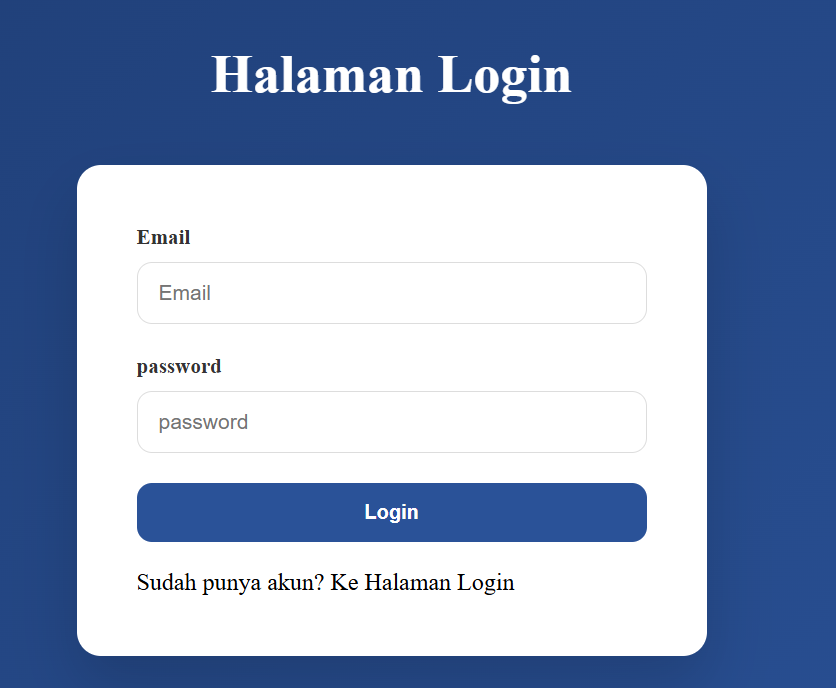
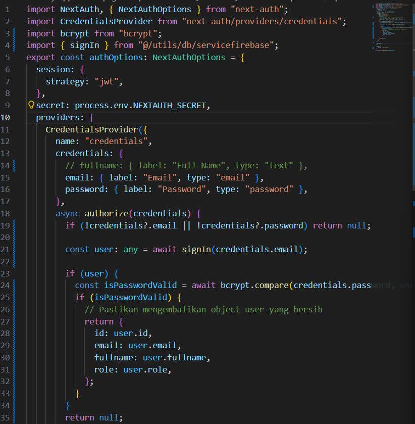
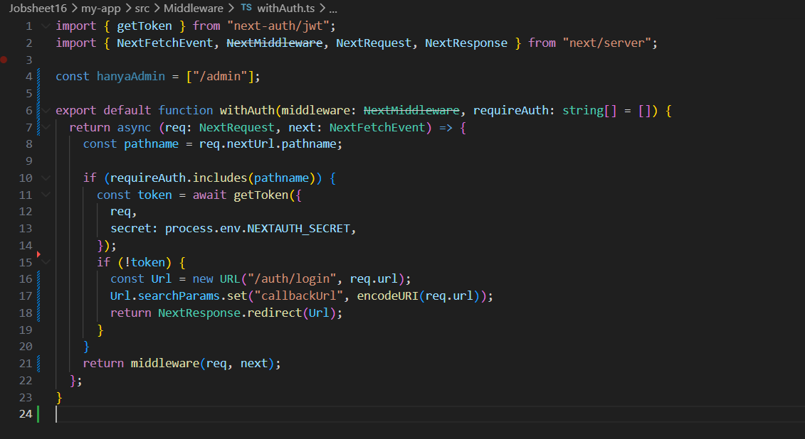

# Laporan Praktikum Jobsheet 16

## Identitas

- **Mata Kuliah**: Pemrograman Berbasis Framework
- **Program Studi**: Teknik Informatika
- **Semester**: 6
- **Praktikum**: Jobsheet 16
- **Nama**: Vincentius Leonanda Prabowo
- **NIM**: 2341720149
- **Kelas**: TI-3D

## Langkah 1 Custom Login Page

**Saat Klik Sign In akan masuk ke halaman Login**  

## Langkah 2 Handle Login Frontend

## Langkah 3 Authorize di NextAuth

## Langkah 4 Menambahkan Role ke Token

## Langkah 5 CallBack URL Logic

## Langkah 6 Membuat Halaman Admin dan Authorize

### Hanya admin yang bisa masuk halaman admin

## UJI

## Pertanyaan Analisis & Jawaban

1. Mengapa password harus diverifikasi dengan bcrypt.compare?  
   Karena password di database disimpan dalam bentuk hash, sehingga perlu `bcrypt.compare` untuk mencocokkan password asli dengan hash secara aman.

2. Mengapa role disimpan di token?  
   Agar proses otorisasi bisa dilakukan tanpa harus query ke database setiap request.

3. Apa fungsi callbackUrl?  
   Untuk mengarahkan user kembali ke halaman yang dituju setelah berhasil login.

4. Mengapa middleware penting untuk security?  
   Karena middleware bisa membatasi akses ke halaman tertentu sebelum halaman diakses oleh user.

5. Apa risiko jika role tidak dicek di middleware?  
   User yang tidak berhak (misalnya non-admin) bisa mengakses halaman sensitif seperti admin.
