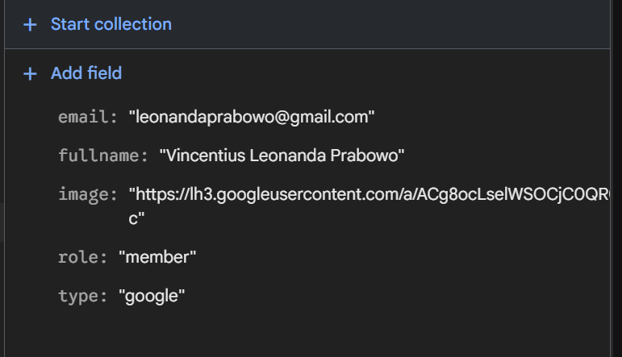
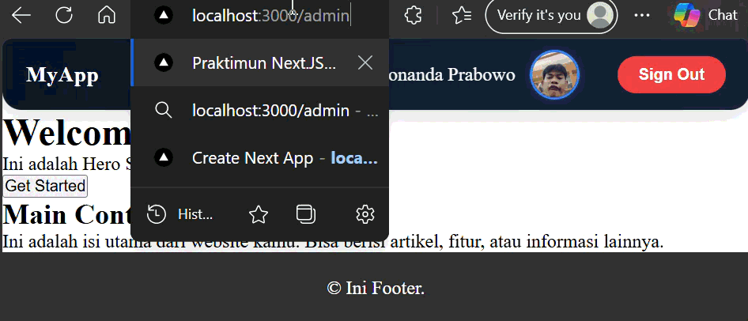
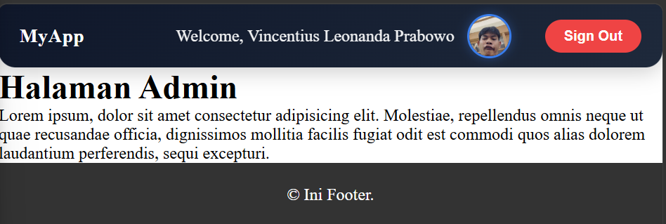
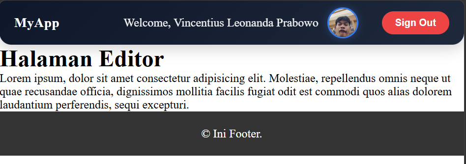
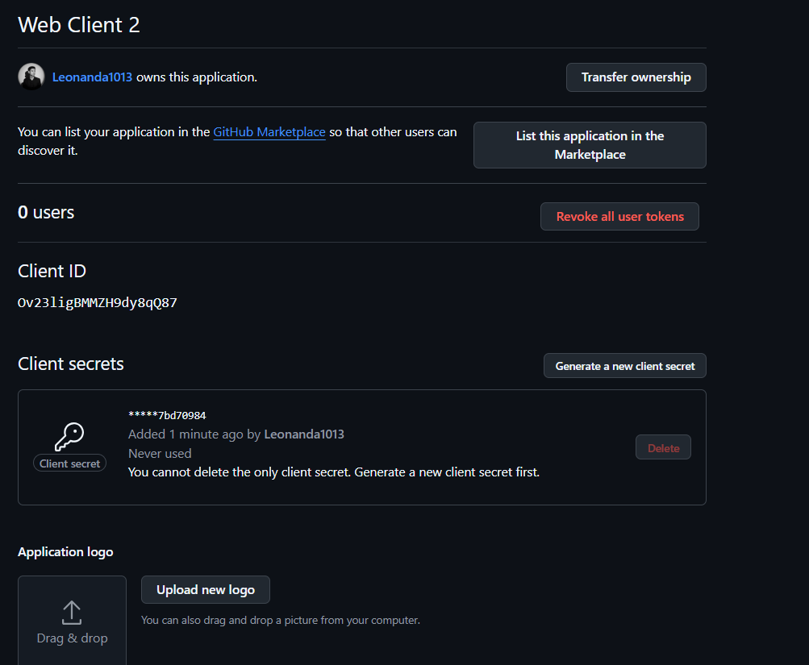
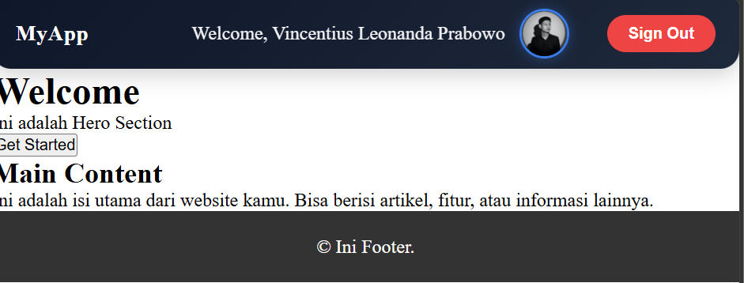
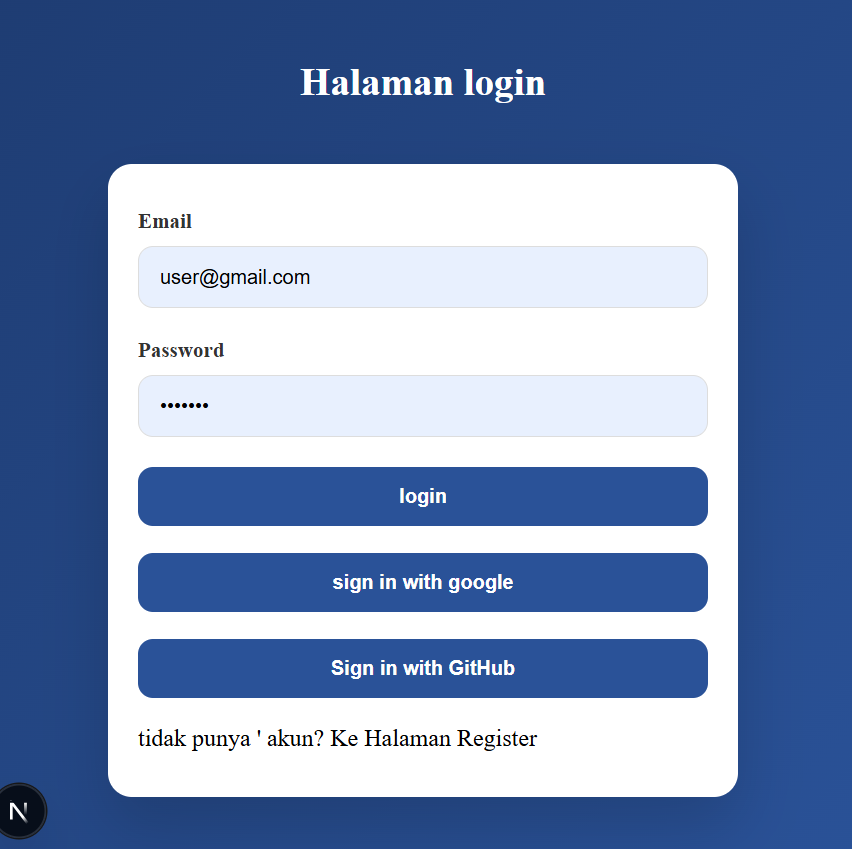

# Laporan Praktikum Jobsheet 17

## Identitas

- **Mata Kuliah**: Pemrograman Berbasis Framework
- **Program Studi**: Teknik Informatika
- **Semester**: 6
- **Praktikum**: Jobsheet 17
- **Nama**: Vincentius Leonanda Prabowo
- **NIM**: 2341720149
- **Kelas**: TI-3D


## Langkah 1 & 2 Masuk ke Google CLoude Console & Buat Project Baru


## Langkah 3 – Konfigurasi OAuth Consent Screen


## Langkah 4 - Tambahkan Environment Variables


## Langkah 5 - Konfigurasi Google Provider di NextAuth dan Handle Callback JWT & Session

```js
import NextAuth, { NextAuthOptions } from "next-auth";
import CredentialsProvider from "next-auth/providers/credentials";
import GoogleProvider from "next-auth/providers/google";
import bcrypt from "bcrypt";

import { signIn } from "@/utils/db/servicefirebase";

export const authOptions: NextAuthOptions = {
  session: {
    strategy: "jwt",
  },

  secret: process.env.NEXTAUTH_SECRET,

  providers: [
    CredentialsProvider({
      name: "credentials",
      credentials: {
        email: { label: "Email", type: "email" },
        password: { label: "Password", type: "password" },
      },

      async authorize(credentials) {
        if (!credentials?.email || !credentials?.password) return null;

        const user: any = await signIn(credentials.email);

        if (user) {
          const isPasswordValid = await bcrypt.compare(
            credentials.password,
            user.password
          );

          if (isPasswordValid) {
            return {
              id: user.id,
              email: user.email,
              fullname: user.fullname,
              role: user.role,
            };
          }
        }

        return null;
      },
    }),

    GoogleProvider({
      clientId: process.env.GOOGLE_CLIENT_ID || "",
      clientSecret: process.env.GOOGLE_CLIENT_SECRET || "",
    }),
  ],

  callbacks: {
    async jwt({ token, account, user }: any) {
      // Login via Credentials
      if (account?.provider === "credentials" && user) {
        token.email = user.email;
        token.fullname = user.fullname;
        token.role = user.role;
      }

      // Login via Google
      if (account?.provider === "google" && user) {
        const data = {
          fullname: user.name,
          email: user.email,
          image: user.image,
          role: account.provider,
        };

        token.fullname = data.fullname;
        token.email = data.email;
        token.image = data.image;
        token.role = data.role;
      }

      return token;
    },

    async session({ session, token }: any) {
      if (token.email) session.user.email = token.email;
      if (token.fullname) session.user.fullname = token.fullname;
      if (token.image) session.user.image = token.image;
      if (token.role) session.user.role = token.role;

      return session;
    },
  },

  pages: {
    signIn: "/auth/login",
  },
};

export default NextAuth(authOptions);
```

# Langkah 6 - Tambahkan Button Login Google


# Langkah 7 - Simpan data Google ke Database


# UJI
1. Data Tersimapn Di FireStore


2. Login Google kedua kali


3. User Role member akses admin


4. Admin akses admin


5. Avatar tampil


## Analisis & Diskusi – NextAuth

### 1. Apa perbedaan login credential dan login Google?

Credentials memakai email-password yang diverifikasi database sendiri, sedangkan Google login menggunakan OAuth dari Google tanpa menyimpan password.

### 2. Mengapa data Google tetap perlu disimpan ke database?

Data Google disimpan agar sistem bisa mengenali user, menambah role, dan mengelola fitur internal.

### 3. Apa fungsi JWT callback?

JWT callback berfungsi menyimpan dan membawa data user dalam token agar tidak perlu query database berulang.

### 4. Mengapa perlu multi-role?

Multi-role diperlukan untuk membedakan hak akses user seperti admin dan user.

### 5. Apa risiko jika tidak menyimpan user ke database?

Tanpa database, sistem tidak bisa menyimpan role, mengontrol akses, atau mempertahankan data user.


## Tugas Mandiri
1. Halaman dan role editor


2. Github credential


3. Login Github



