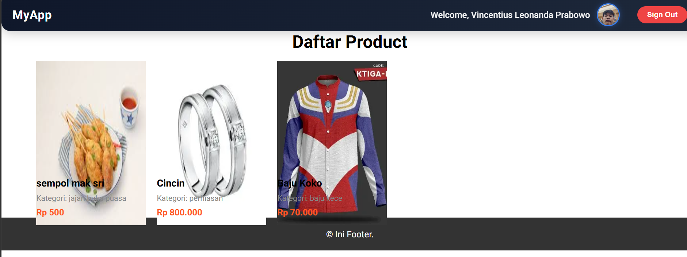
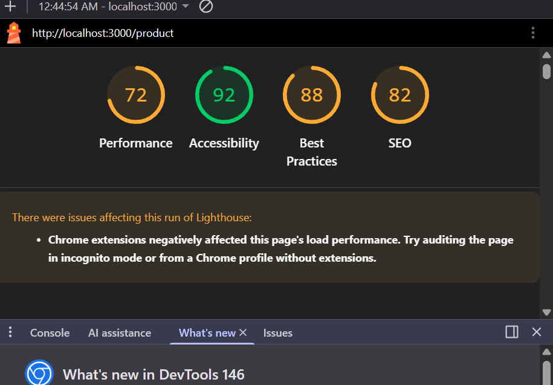
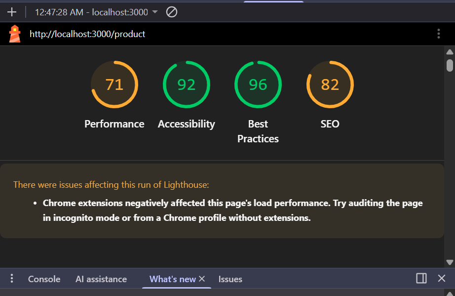

# Laporan Praktikum Jobsheet 18

## Identitas

- **Mata Kuliah**: Pemrograman Berbasis Framework
- **Program Studi**: Teknik Informatika
- **Semester**: 6
- **Praktikum**: Jobsheet 18
- **Nama**: Vincentius Leonanda Prabowo
- **NIM**: 2341720149
- **Kelas**: TI-3D

## Langkah 1 - Optimasi Gambar Lokal

## Langkah 2 - Optimasi Gambar Remote

## Langkah 3 - Optimasi Font

## Langkah 4 - Optimasi Script
 

Perbedaan utamanya adalah React/JSX merender teks langsung (lebih cepat, SEO-friendly, dan aman), sedangkan Script dengan manipulasi DOM (innerHTML) menunda render (bisa berkedip), kurang baik untuk SEO, dan berisiko keamanan.

## Langkah 5 - Optimasi Avatar

## After

## Before

## Pembahasan 
Performance fokus ke speed → naik ✔  
Best Practices fokus ke standar & keamanan → bisa turun ❌ jika ada teknik yang “tidak ideal”

