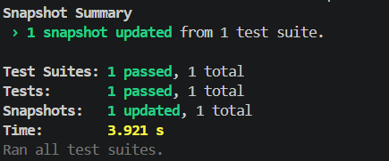
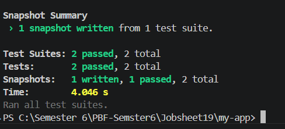
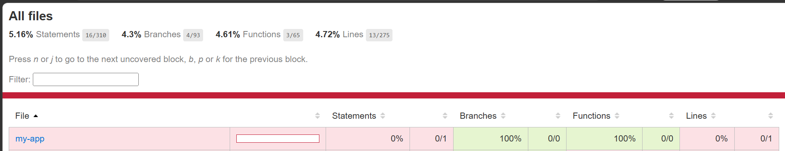
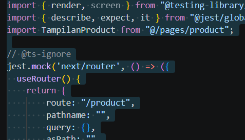

# Laporan Praktikum Jobsheet 19

## Identitas

- **Mata Kuliah**: Pemrograman Berbasis Framework
- **Program Studi**: Teknik Informatika
- **Semester**: 6
- **Praktikum**: Jobsheet 19
- **Nama**: Vincentius Leonanda Prabowo
- **NIM**: 2341720149
- **Kelas**: TI-3D

## Praktikum 1 - Setup Jest di Next.js


## Praktikum 2 - Struktur Folder Setting


## Praktikum 3 - Testing Halaman About


## Praktikum 4 - Converage report


## Praktikum 5 - Konfigurasi Converage Lengkap


## Praktikum 6 - Testing dengan getByTestId


## Praktikum 7 & 8 Testing Page dengan Router



## Tugas
1. Buat Unit tes
```js
import { render, screen } from "@testing-library/react";
import { describe, expect, it } from "@jest/globals";
import TampilanProduct from "@/pages/product";

// @ts-ignore
jest.mock('next/router', () => ({
  useRouter() {
    return {
        route: "/product",
        pathname: "",
        query: {},
        asPath: "",
        push: () => {}, 
        events: {
            on: () => {},
            off: () => {}
        },
        isReady: true,
    }
  },
}));

describe("Product Page", () => {
  it("renders product page correctly", () => {
    const page = render(<TampilanProduct />);
    // expect(screen.getByTestId("title").textContent).toBe("Product Page");
    expect(page).toMatchSnapshot();
  });
});
```
<br>

```js
import { render, screen } from '@testing-library/react';
import { describe, expect, it } from '@jest/globals'; 
import Footer from '../../components/layouts/footer';

describe('Footer Component', () => {
  it('renders footer correctly', () => {
    const page = render(<Footer />);
    expect(screen.getByTestId('footer').textContent).toBe('Footer');
    expect(page).toMatchSnapshot();
  });
});
```

2. Gunakan minimal:
<br>
1 Snapshot test <br>
1 toBe() <br>
1 getByTestId() <br>

```js
import { render, screen } from "@testing-library/react";
import { describe, expect, it } from "@jest/globals";
import AboutPage from "@/pages/about";

describe("AboutPage", () => {
  it("renders about page correctly", () => {
    const page = render(<AboutPage />);
    expect(screen.getByTestId("title").textContent).toBe("About Page");
    expect(page).toMatchSnapshot();
  });
});
```

4. Lakukan Mocking Router



## Diskusi dan Refleksi


### 1. Mengapa unit testing penting sebelum production?

Untuk memastikan setiap fungsi berjalan benar sejak awal, mengurangi bug, dan mencegah error besar saat sudah di production.

### 2. Mengapa branch coverage sulit mencapai 100%?

Karena banyak kondisi (if/else, edge cases) yang sulit diuji semua, terutama skenario yang jarang terjadi atau kompleks.

### 3. Apa itu mocking?

Teknik untuk mengganti dependency asli (API, database, dll) dengan versi palsu agar testing lebih cepat dan terkontrol.

### 4. Kapan snapshot test digunakan?

Saat ingin memastikan UI atau output tidak berubah secara tidak sengaja (biasanya pada frontend seperti React).

### 5. Apakah semua file harus dites?

Tidak. Fokus pada bagian penting (logic utama, business rules), bukan file sederhana seperti config atau UI statis.


