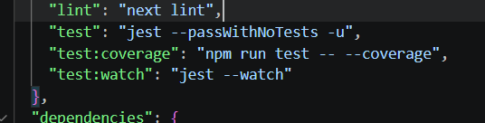
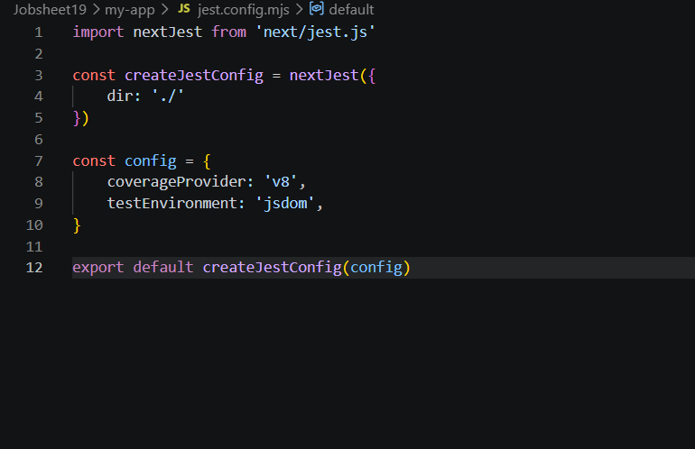
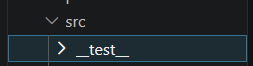
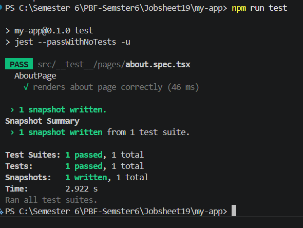
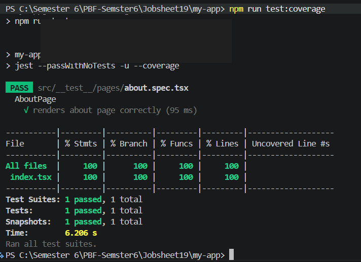
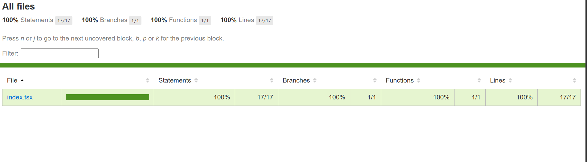
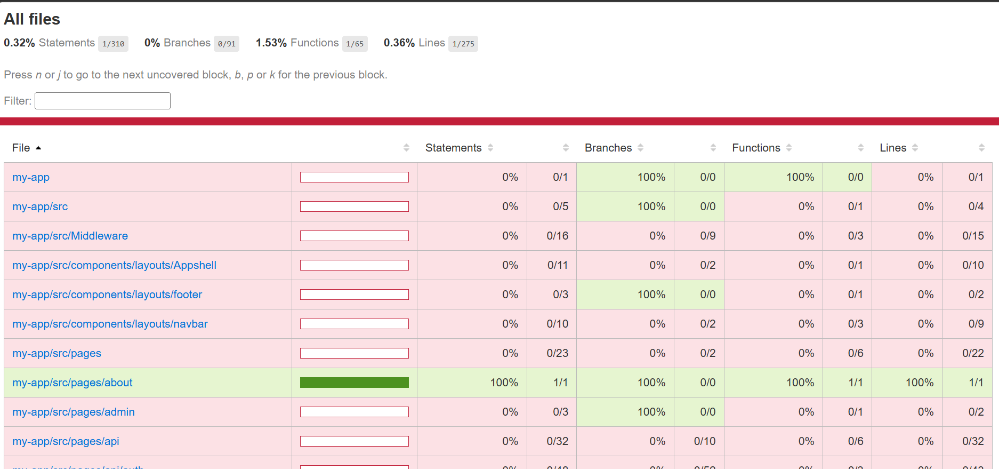

# Laporan Praktikum Jobsheet 19

## Identitas

- **Mata Kuliah**: Pemrograman Berbasis Framework
- **Program Studi**: Teknik Informatika
- **Semester**: 6
- **Praktikum**: Jobsheet 19
- **Nama**: Vincentius Leonanda Prabowo
- **NIM**: 2341720149
- **Kelas**: TI-3D

## Praktikum 1 - Setup Jest di Next.js

## Praktikum 2 - Struktur Folder Setting

## Praktikum 3 - Testing Halaman About

## Praktikum 4 - Converage report

## Praktikum 5 - Konfigurasi Converage Lengkap
