# Laporan Praktikum Jobsheet 02

## Identitas

- **Mata Kuliah**: Pemrograman Berbasis Framework
- **Program Studi**: Teknik Informatika
- **Semester**: 6
- **Praktikum**: Jobsheet 02
- **Nama**: Vincentius Leonanda Prabowo
- **NIM**: 2341720149
- **Kelas**: TI-3D

## 1. Routing dasar


## 2. Routing Menggunakan Folder

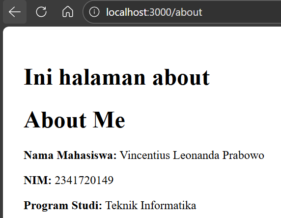

## 3. Nested Routing

### a.

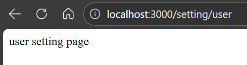
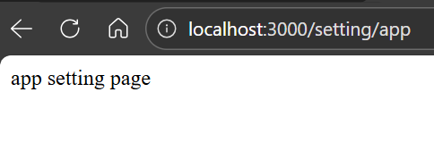
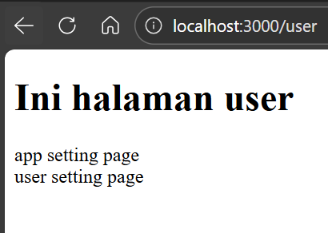

### b.

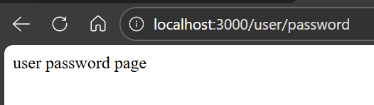

## 4. Dynamic Route

### a. Halaman Product

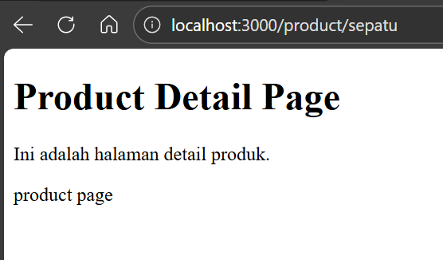

### b. ambil


### c. coba

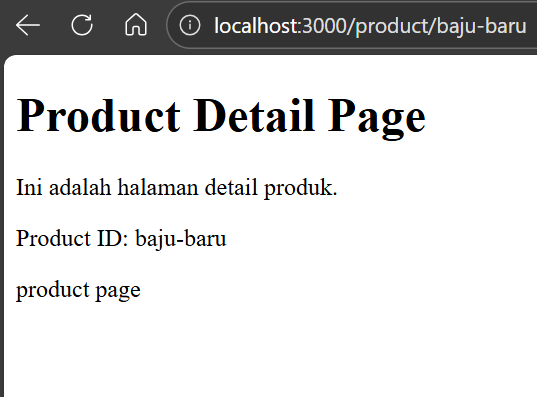

## 5. Membuat Komponen Navbar

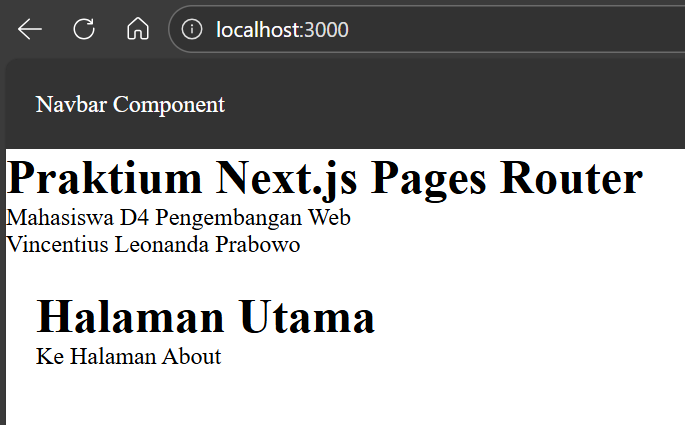
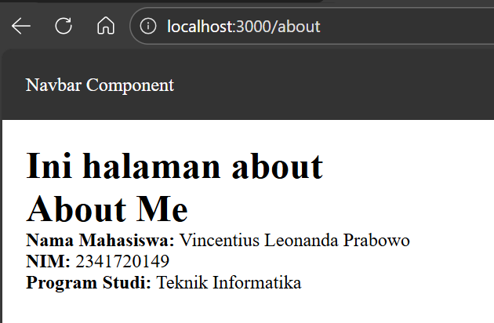

## 6. Membuat Layout Global Appshell

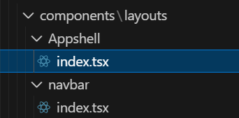

## 7. Implementasi Layout

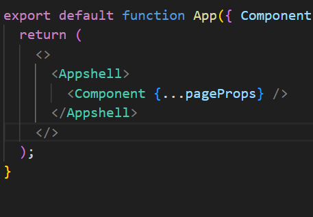

## Tugas 1


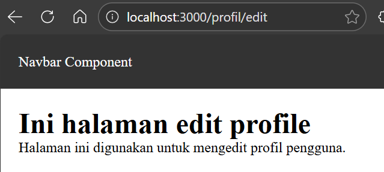

## Tugas 2

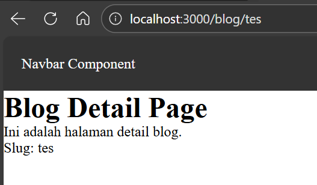

## Tugas 3

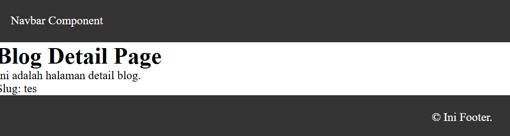

## Pertanyaan Refleksi

### 1. Perbedaan routing berbasis file dan routing manual

- **File-based routing**: otomatis dari nama file (contoh: `pages/about.js` → `/about`)
- **Manual routing**: harus diatur sendiri (misalnya pakai React Router)

---

### 2. Mengapa dynamic routing penting?

Dynamic routing memungkinkan halaman menggunakan parameter seperti:

```
/blog/[slug]
```

### 3. Keuntungan layout global

Layout global digunakan untuk komponen yang dipakai di semua halaman (Navbar, Footer).

Keuntungan:

- Tidak perlu tulis ulang di setiap page
- Kode lebih rapi
- Konsisten di seluruh aplikasi
