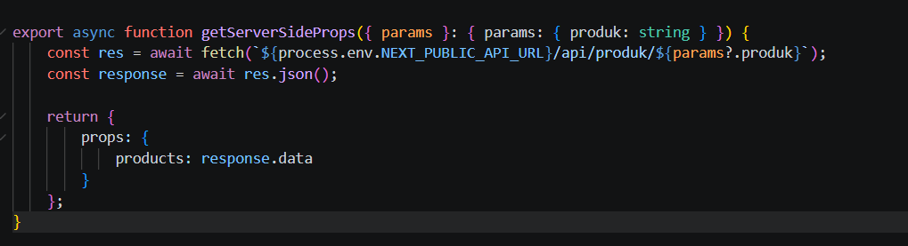
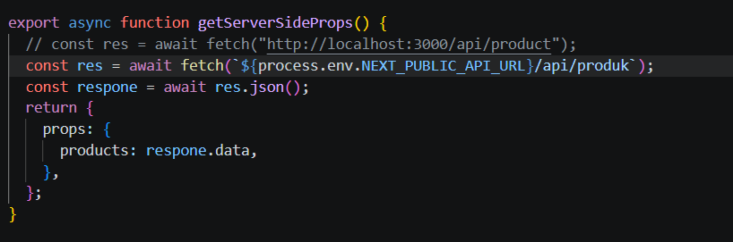
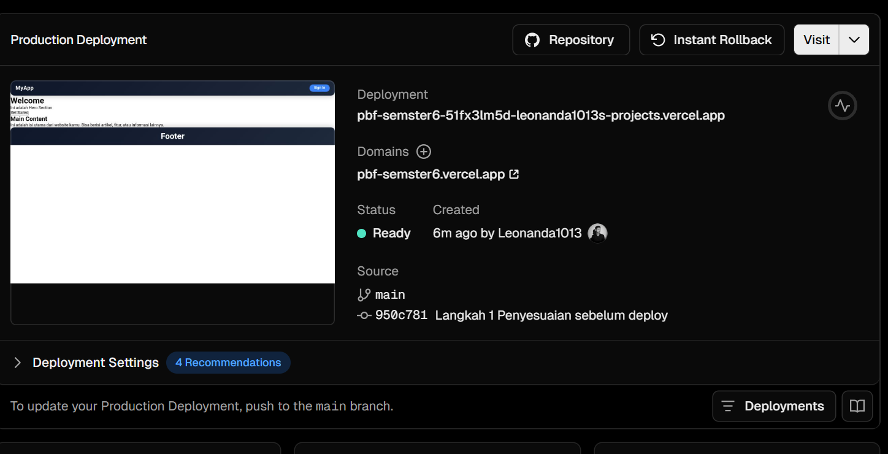
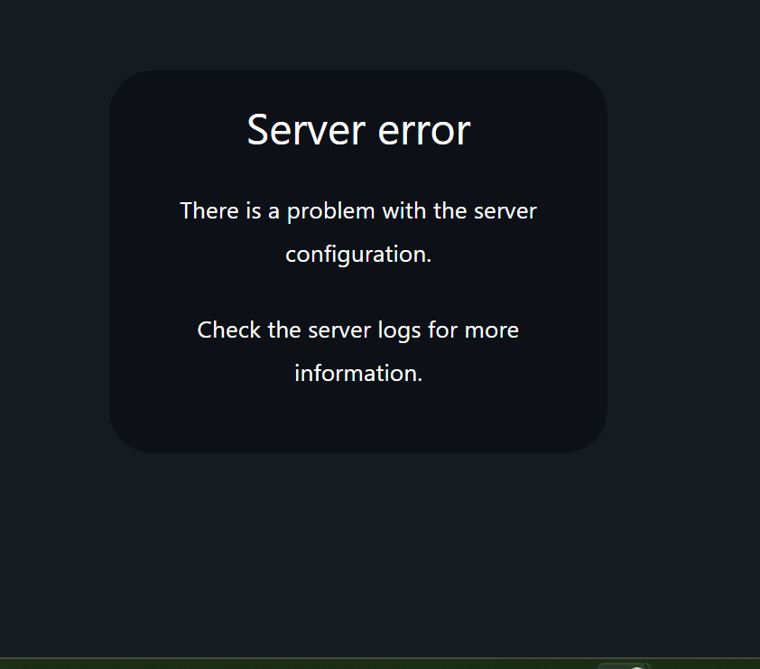
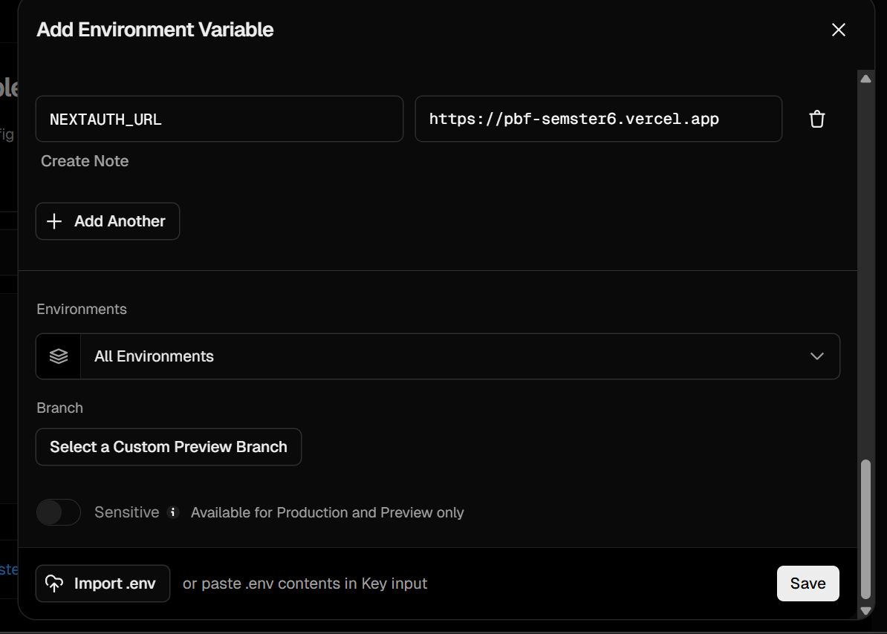
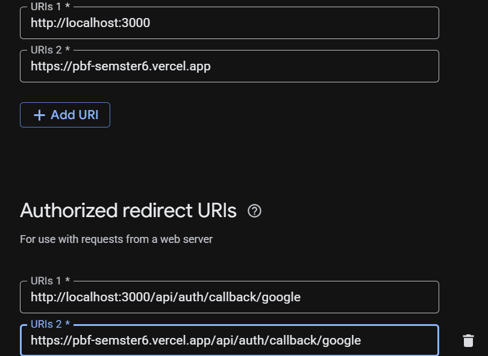
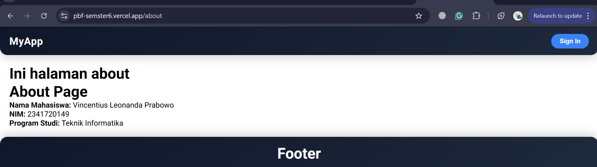
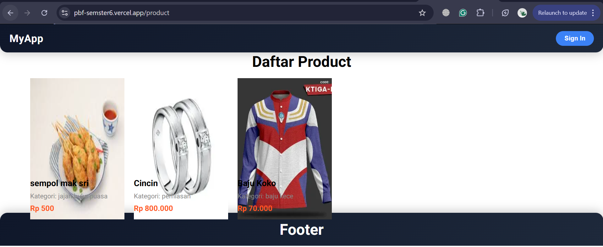
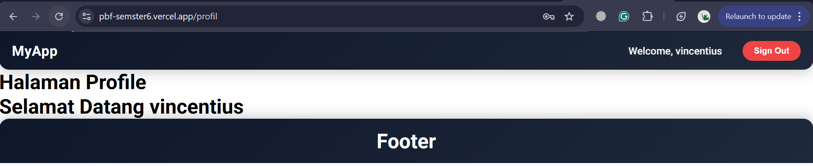

# Laporan Praktikum Jobsheet 20

## Identitas

- **Mata Kuliah**: Pemrograman Berbasis Framework
- **Program Studi**: Teknik Informatika
- **Semester**: 6
- **Praktikum**: Jobsheet 20
- **Nama**: Vincentius Leonanda Prabowo
- **NIM**: 2341720149
- **Kelas**: TI-3D

## Langkah 1 - Lakukan Penyesuaian
1. Hapus static.tsx
2. ubah [product].tsx
3. ubah server.tsx
4. Gunakan SSR

## Langkah 2 - Percobaan Deploy

## Langkah 3 Enviroment Variable

## Langkah 4 Konfigurasi Google Outh Production

## UJI
1. /  

2. /about  

3. /product 

4. /profile 

5. login credential

6. login google

## Tugas Praktikum (sudah dilakukan diatas)

### 1. Mengapa localhost tidak boleh digunakan di production?

Karena `localhost` hanya berlaku di komputer sendiri. Saat production, server berada di internet sehingga harus menggunakan domain publik, bukan localhost.

---

### 2. Mengapa SSG bisa gagal saat build?

Karena SSG mengambil data saat build time. Jika API error, URL salah, atau data tidak tersedia, proses build akan gagal.

---

### 3. Apa perbedaan SSR dan SSG saat deployment?

* **SSR (Server-Side Rendering):** data diambil saat request (runtime).
* **SSG (Static Site Generation):** data diambil saat build (build time).
   SSG lebih cepat, tapi lebih rentan gagal saat build.

---

### 4. Mengapa perlu redeploy setelah menambahkan environment?

Karena environment variable hanya dibaca saat build/deploy. Jika tidak redeploy, perubahan tidak akan diterapkan.

---

### 5. Apa fungsi redirect URI pada OAuth?

Sebagai URL tujuan setelah login. OAuth (misalnya Google) akan mengirim user kembali ke aplikasi melalui URI ini, sehingga harus sesuai dan terdaftar untuk keamanan.
