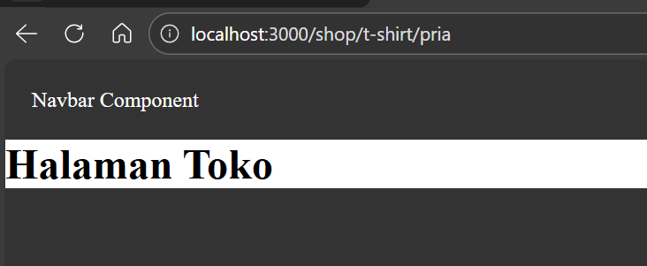
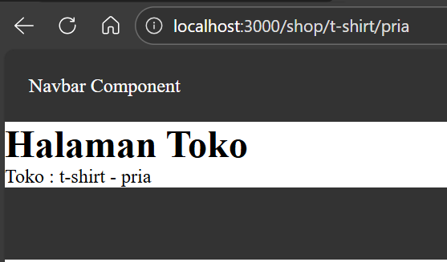
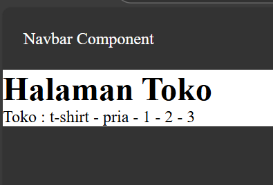
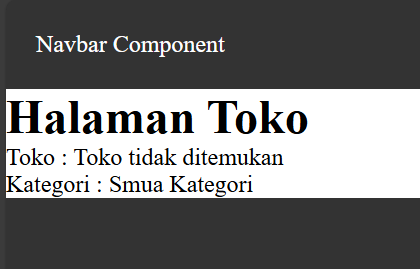
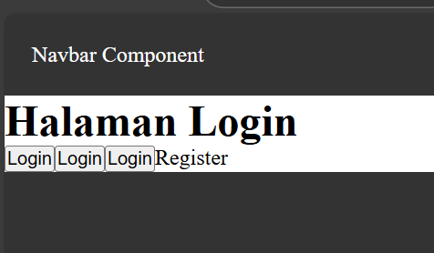
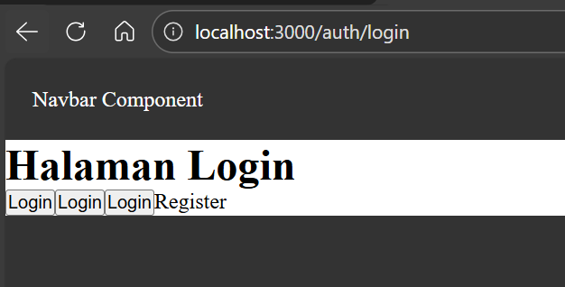

# Laporan Praktikum Jobsheet 03

## Identitas

- **Mata Kuliah**: Pemrograman Berbasis Framework
- **Program Studi**: Teknik Informatika
- **Semester**: 6
- **Praktikum**: Jobsheet 03
- **Nama**: Vincentius Leonanda Prabowo
- **NIM**: 2341720149
- **Kelas**: TI-3D

## Langkah 1 Menjalankan Project

## Langkah 2 Membuat Catch-All Route

## Langkah 3 Pengujuan Catch-All Route

## Langkah 4 Optional Catch-All Route

## Langkah 5 Validasi Parameter

## Langkah 6 Membuat Halaman Login dan Register

## Langkah 7 Navigasi Imeratif

## Langkah 8 Simulasi Redirect

