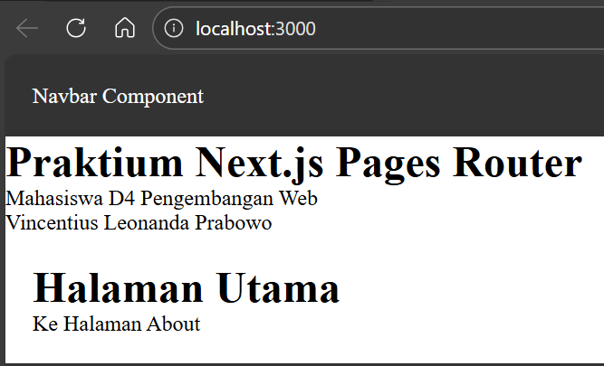
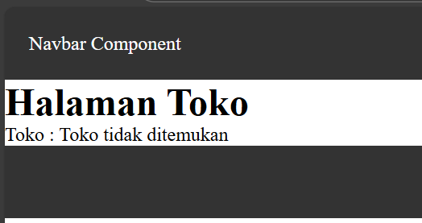
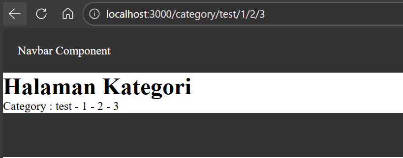
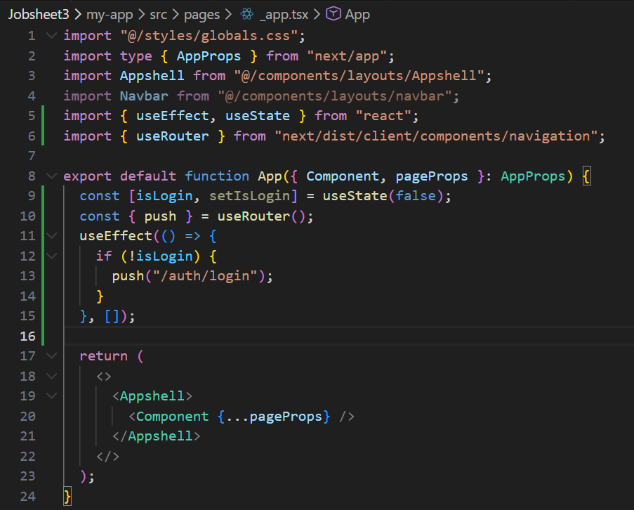

# Laporan Praktikum Jobsheet 03

## Identitas

- **Mata Kuliah**: Pemrograman Berbasis Framework
- **Program Studi**: Teknik Informatika
- **Semester**: 6
- **Praktikum**: Jobsheet 03
- **Nama**: Vincentius Leonanda Prabowo
- **NIM**: 2341720149
- **Kelas**: TI-3D

## Langkah 1 Menjalankan Project



## Langkah 2 Membuat Catch-All Route


## Langkah 3 Pengujuan Catch-All Route


## Langkah 4 Optional Catch-All Route



## Langkah 5 Validasi Parameter


## Langkah 6 Membuat Halaman Login dan Register


## Langkah 7 Navigasi Imeratif


## Langkah 8 Simulasi Redirect


## Tugas 1



## Tugas 2


## Tugas 3



## Pertanyaan Reflektif

### 1. Perbedaan `[id].js` dan `[...slug].js`

- `[id].js` → hanya menangkap **1 parameter**

  ```
  /product/1 → id = 1
  ```

- `[...slug].js` → menangkap **banyak parameter (array)**

  ```
  /shop/a/b/c → slug = ["a","b","c"]
  ```

---

### 2. Mengapa slug berbentuk array?

Karena `[...slug]` bisa menerima banyak bagian URL.

Contoh:

```
/category/test/1/2
```

Hasil:

```js
slug = ["test", "1", "2"];
```

Jadi array digunakan untuk menampung banyak nilai sekaligus.

---

### 3. Kapan menggunakan `Link` dan `router.push()`?

- **Link** → untuk navigasi biasa (klik)

  ```jsx
  <Link href="/about">Ke About</Link>
  ```

- **router.push()** → untuk navigasi lewat kode (programmatic)

  ```js
  router.push("/login");
  ```

Gunakan:

- Link → UI (button/menu)
- push → logic (redirect, login, dll)

---

### 4. Mengapa navigasi Next.js tidak me-refresh halaman?

Karena Next.js menggunakan **client-side navigation** (SPA).

Artinya:

- hanya ganti komponen, bukan reload halaman
- lebih cepat & smooth

---

## Kesimpulan

- `[id]` → 1 parameter
- `[...slug]` → banyak parameter (array)
- `Link` → navigasi biasa
- `router.push()` → navigasi lewat kode
- Next.js tidak refresh karena SPA
