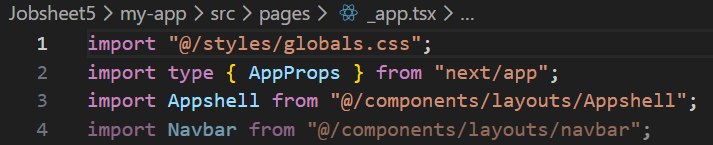
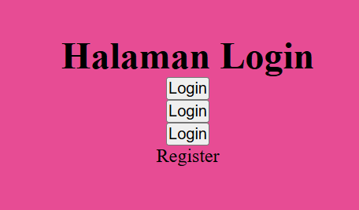
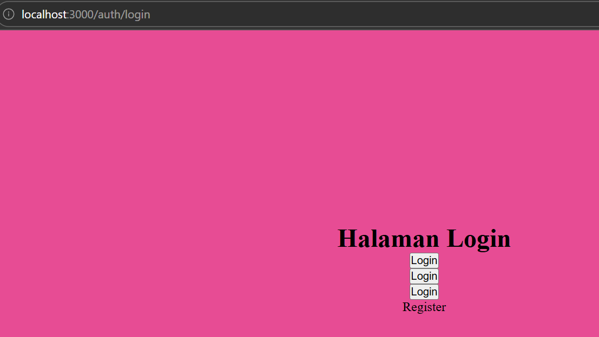
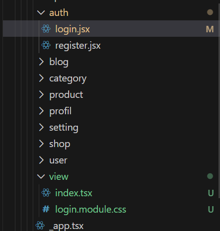
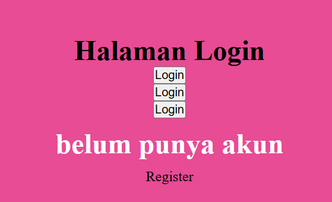
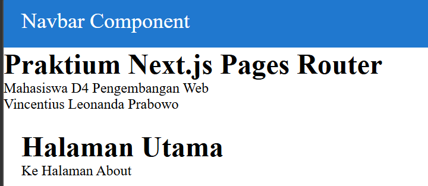
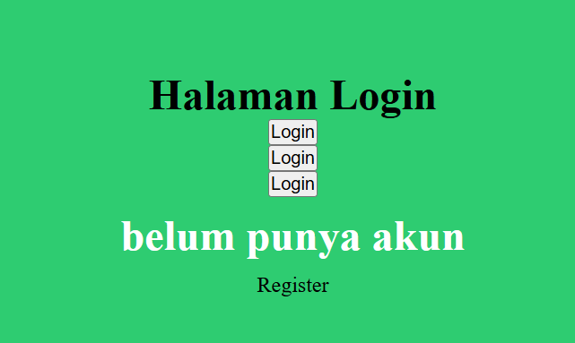
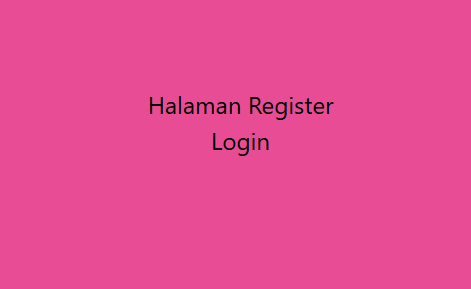
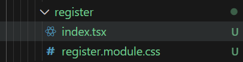

# Laporan Praktikum Jobsheet 05

## Identitas

- **Mata Kuliah**: Pemrograman Berbasis Framework
- **Program Studi**: Teknik Informatika
- **Semester**: 6
- **Praktikum**: Jobsheet 05
- **Nama**: Vincentius Leonanda Prabowo
- **NIM**: 2341720149
- **Kelas**: TI-3D

## Langkah 1 : Globas CSS

## Langkah 2 : CSS Module (local scope)

## Langkah 3 : Styling Untuk Pages (CSS Module)

## Langkah 4 : Conditional Rendering Navbar (Tanpa Navbar di Login)

## Langkah 5 : Refactoring Struktur Project (Best Practice)

## Langkah 6 : Inline Styling (CSS in JS)

## Langkah 7 : Kombinasi Global CSS dan CSS Module

## Langkah 8 : SCSS (SASS)

## Langkah 9 : Tailwind

## Tugas 1

