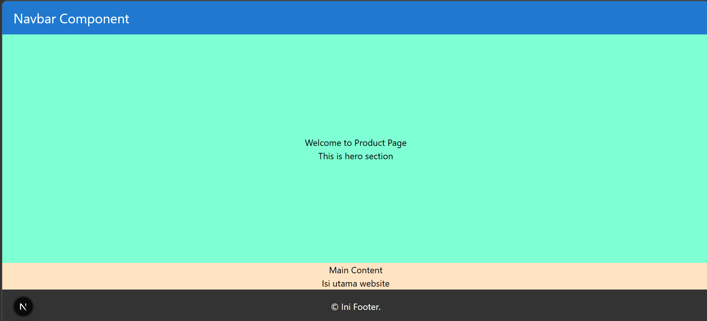
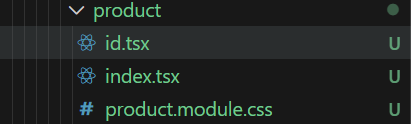
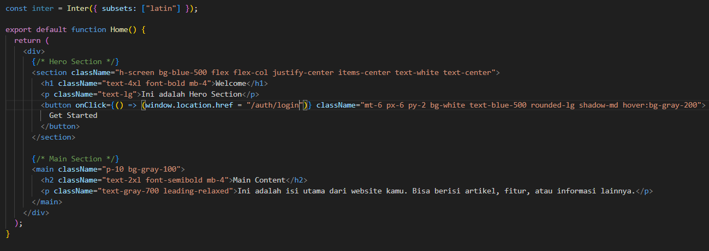

# Laporan Praktikum Jobsheet 05

## Identitas

- **Mata Kuliah**: Pemrograman Berbasis Framework
- **Program Studi**: Teknik Informatika
- **Semester**: 6
- **Praktikum**: Jobsheet 05
- **Nama**: Vincentius Leonanda Prabowo
- **NIM**: 2341720149
- **Kelas**: TI-3D

## Langkah 1 : Globas CSS

## Langkah 2 : CSS Module (local scope)

## Langkah 3 : Styling Untuk Pages (CSS Module)

## Langkah 4 : Conditional Rendering Navbar (Tanpa Navbar di Login)

## Langkah 5 : Refactoring Struktur Project (Best Practice)

## Langkah 6 : Inline Styling (CSS in JS)

## Langkah 7 : Kombinasi Global CSS dan CSS Module

## Langkah 8 : SCSS (SASS)

## Langkah 9 : Tailwind

## Tugas 1

## Tugas 2

## Tugas 3

## Pertanyaan Refleksi

### 1. Kapan sebaiknya menggunakan CSS Module dibanding Global CSS?

CSS Module sebaiknya digunakan ketika kita ingin menjaga agar styling tetap terisolasi pada setiap komponen, terutama dalam pengembangan aplikasi berbasis komponen seperti React atau Next.js. Dengan CSS Module, setiap class akan memiliki nama unik sehingga tidak saling bertabrakan dengan style dari komponen lain, yang sangat penting dalam project dengan banyak halaman atau tim developer. Sementara itu, Global CSS lebih tepat digunakan untuk kebutuhan styling yang bersifat umum seperti reset CSS, pengaturan font dasar, atau layout global yang digunakan di seluruh aplikasi.

### 2. Apa kelemahan inline styling?

Inline styling memiliki kelemahan karena penulisan style langsung di dalam elemen membuat kode menjadi kurang rapi dan sulit untuk dikelola, terutama ketika project semakin besar. Selain itu, inline styling tidak dapat digunakan kembali sehingga sering menyebabkan duplikasi kode, serta tidak mendukung fitur CSS seperti pseudo-class misalnya hover atau focus. Hal ini membuat inline styling kurang fleksibel dan kurang cocok untuk pengembangan aplikasi yang kompleks.

### 3. Mengapa SCSS cocok untuk project skala besar?

SCSS cocok digunakan dalam project skala besar karena menyediakan fitur tambahan seperti variable, nesting, mixin, dan modularisasi file yang membuat kode lebih terstruktur dan mudah dipelihara. Dengan adanya fitur-fitur tersebut, developer dapat mengelola styling dengan lebih efisien dan konsisten, sehingga sangat membantu dalam project yang memiliki banyak komponen dan kompleksitas tinggi.

### 4. Apa keunggulan Tailwind dibanding CSS tradisional?

Tailwind CSS memiliki keunggulan utama dalam pendekatan utility-first, di mana developer dapat langsung menuliskan class untuk styling tanpa perlu membuat file CSS terpisah. Hal ini mempercepat proses development dan menjaga konsistensi desain karena menggunakan sistem yang sudah terstandarisasi. Selain itu, Tailwind juga memudahkan pembuatan desain responsif dan mengurangi penulisan CSS custom, meskipun class yang digunakan bisa terlihat cukup panjang.
