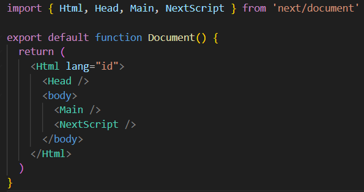
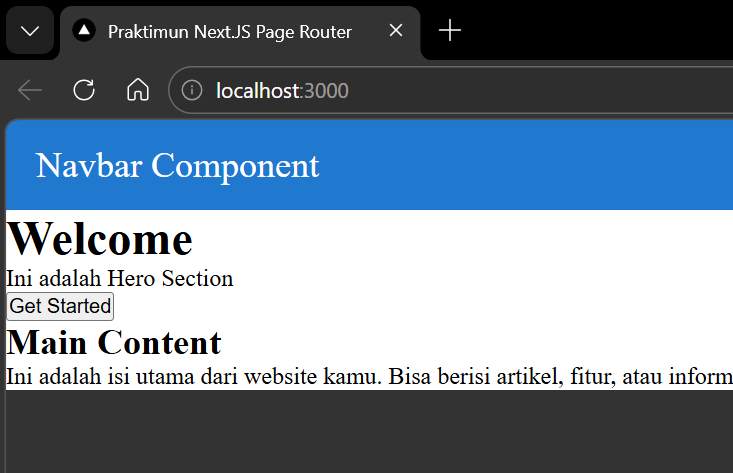
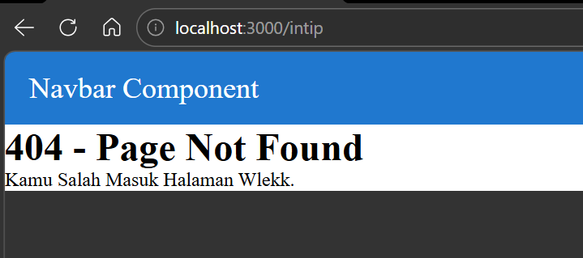
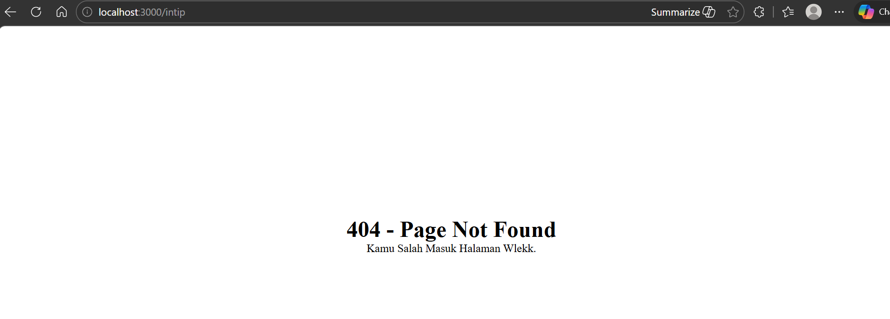

# Laporan Praktikum Jobsheet 06

## Identitas

- **Mata Kuliah**: Pemrograman Berbasis Framework
- **Program Studi**: Teknik Informatika
- **Semester**: 6
- **Praktikum**: Jobsheet 06
- **Nama**: Vincentius Leonanda Prabowo
- **NIM**: 2341720149
- **Kelas**: TI-3D

## Langah 1 Jalankan Project

## Langkah 2 Membuat Custom Document

## Langkah 3 Pengaturan Title

## Langkah 4 Membuat Custom Eror Page

## Langkah 5 Styling Halaman 404

## Langah 6 MEnampilkan Gambar dari Folder Public

