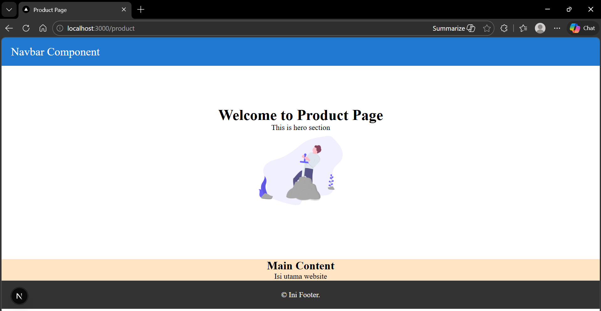

# Laporan Praktikum Jobsheet 06

## Identitas

- **Mata Kuliah**: Pemrograman Berbasis Framework
- **Program Studi**: Teknik Informatika
- **Semester**: 6
- **Praktikum**: Jobsheet 06
- **Nama**: Vincentius Leonanda Prabowo
- **NIM**: 2341720149
- **Kelas**: TI-3D

## Langah 1 Jalankan Project

## Langkah 2 Membuat Custom Document

## Langkah 3 Pengaturan Title

## Langkah 4 Membuat Custom Eror Page

## Langkah 5 Styling Halaman 404

## Langah 6 MEnampilkan Gambar dari Folder Public

## Tugas 1

## Tugas 2

## Tugas 3

## Pertanyaan Refleksi

### 1. Apa fungsi utama \_document.js?

File `_document.js` di Next.js digunakan untuk mengatur struktur dasar HTML dari aplikasi, seperti `<html>`, `<head>`, dan `<body>`. Biasanya file ini dipakai untuk kebutuhan global seperti menambahkan font, meta tag, atau konfigurasi server-side rendering, bukan untuk konten halaman.

### 2. Mengapa `<title>` tidak disarankan di \_document.js?

Tag `<title>` tidak disarankan diletakkan di `_document.js` karena file tersebut bersifat statis dan tidak berubah-ubah untuk setiap halaman. Jika `<title>` ditaruh di sana, maka semua halaman akan memiliki judul yang sama, sehingga lebih baik menggunakan `Head` di setiap halaman agar judul bisa dinamis.

### 3. Apa perbedaan halaman biasa dan halaman 404.js?

Halaman biasa di Next.js digunakan untuk menampilkan konten sesuai routing yang ada, sedangkan halaman `404.js` adalah halaman khusus yang otomatis ditampilkan ketika user mengakses URL yang tidak ditemukan. Jadi, `404.js` berfungsi sebagai error page bawaan.

### 4. Mengapa folder public tidak perlu di-import?

Folder `public` di Next.js tidak perlu di-import karena semua file di dalamnya otomatis bisa diakses langsung melalui URL. Misalnya, file gambar cukup dipanggil dengan `/nama-file.png` tanpa perlu menggunakan import seperti pada file JavaScript.
