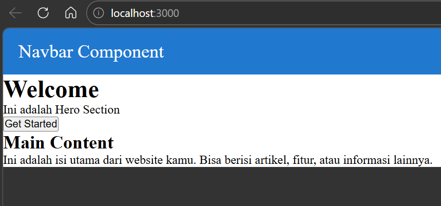
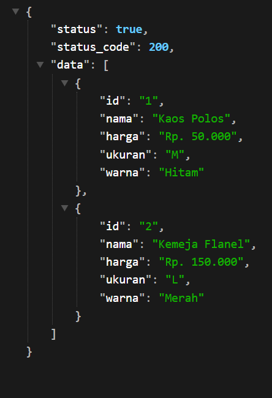
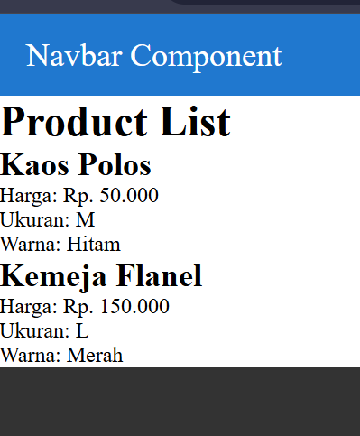
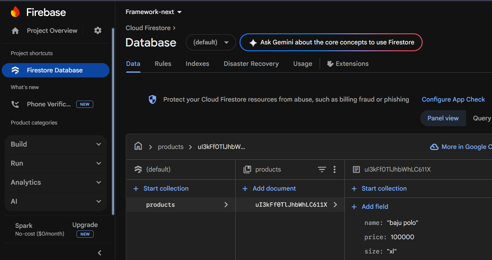

# Laporan Praktikum Jobsheet 06

## Identitas

- **Mata Kuliah**: Pemrograman Berbasis Framework
- **Program Studi**: Teknik Informatika
- **Semester**: 6
- **Praktikum**: Jobsheet 06
- **Nama**: Vincentius Leonanda Prabowo
- **NIM**: 2341720149
- **Kelas**: TI-3D

## Langkah 1 Menjalankan Project

## Langkah 2 Membuat API Product

## Langkah 3 Fetch Data API di Frontend

## Langkah 5 Setup Firebase

