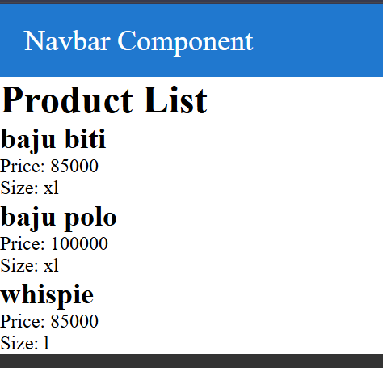
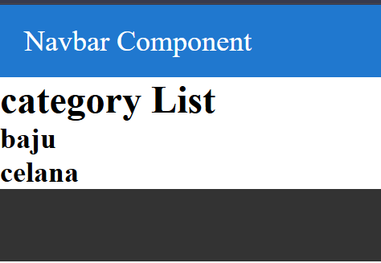
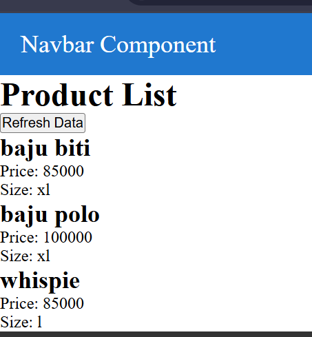

# Laporan Praktikum Jobsheet 06

## Identitas

- **Mata Kuliah**: Pemrograman Berbasis Framework
- **Program Studi**: Teknik Informatika
- **Semester**: 6
- **Praktikum**: Jobsheet 06
- **Nama**: Vincentius Leonanda Prabowo
- **NIM**: 2341720149
- **Kelas**: TI-3D

## Langkah 1 Menjalankan Project

## Langkah 2 Membuat API Product

## Langkah 3 Fetch Data API di Frontend

## Langkah 5 Setup Firebase

## Langkah 6 Install Firebase

## Langkah 7 & 8– Konfigurasi Environment Variable agar credensial firebase tidak dapat dilihat saat dipush di repository

## Langkah 9 Ambil Data dari Firestore

## Langkah 10

## Tugas 1

## Tugas 2

## Tugas 3

### Kode tersebut menampilkan daftar produk dengan mengambil data dari API /api/product, lalu menyimpannya ke state menggunakan useState. Saat halaman pertama kali dibuka, useEffect akan memanggil fungsi getProducts() untuk fetch data tanpa perlu reload halaman. Tombol Refresh Data digunakan untuk mengambil ulang data yang terbaru dengan memanggil fungsi yang sama, sehingga tampilan langsung diperbarui secara otomatis. Selain itu, terdapat state loading untuk memberi indikator saat proses pengambilan data sedang berlangsung agar pengalaman pengguna lebih jelas dan nyaman.

## Pertanyaan refleksi

### 1. Apa fungsi API Routes pada Next.js?

API Routes digunakan untuk membuat backend langsung di dalam Next.js, sehingga kita bisa menangani request (seperti GET, POST) tanpa perlu membuat server terpisah.

### 2. Mengapa .env.local tidak boleh di-push ke repository?

Karena file `.env.local` biasanya berisi data sensitif seperti API key, password, atau konfigurasi penting. Jika di-push, data tersebut bisa bocor ke publik.

### 3. Apa perbedaan data statis dan data dinamis?

- **Data statis**: data yang jarang berubah dan biasanya sudah disiapkan saat build (contoh: halaman profil).
- **Data dinamis**: data yang bisa berubah sewaktu-waktu dan diambil saat runtime (contoh: data produk dari database).

### 4. Mengapa Next.js disebut framework fullstack?

Karena Next.js bisa menangani frontend (tampilan React) dan backend (API Routes, server logic) dalam satu project.
