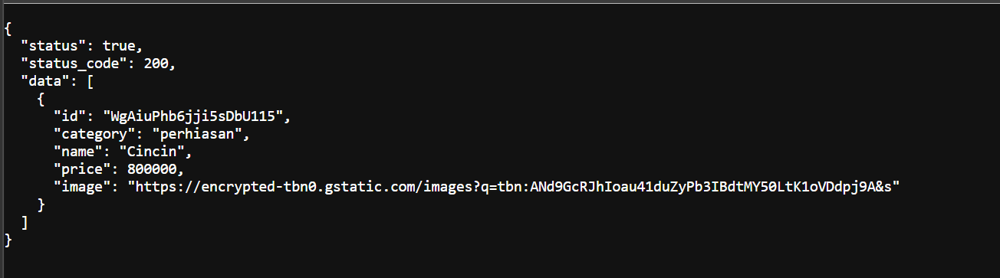
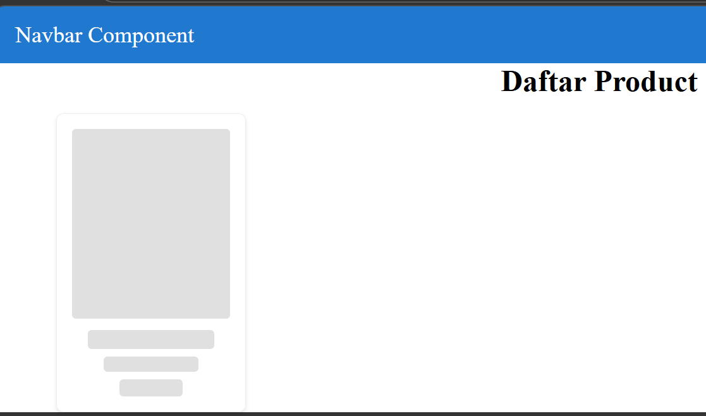
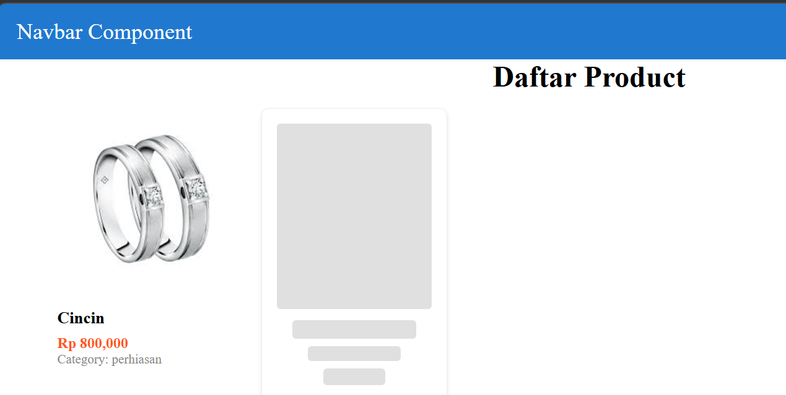

# Laporan Praktikum Jobsheet 08

## Identitas

- **Mata Kuliah**: Pemrograman Berbasis Framework
- **Program Studi**: Teknik Informatika
- **Semester**: 6
- **Praktikum**: Jobsheet 08
- **Nama**: Vincentius Leonanda Prabowo
- **NIM**: 2341720149
- **Kelas**: TI-3D

## Langkah 1 Setup Data Product


## Langkah 2 Implementasi CSR dengan useEffect


## Langkah 3 Implementasi Skeleton Loading



## Langah 5 Implementasi SWR

Menurut saya, dibandingkan hanya mengandalkan useEffect, penggunaan SWR membuat pengelolaan data menjadi lebih terstruktur, terutama dalam hal penanganan error


## Pertanyaan 1

### 1. Client Side Rendering (CSR)
Data dan halaman dibuat di browser (client).  
Awalnya halaman kosong, kemudian diisi menggunakan JavaScript.  

Contoh: menggunakan useEffect atau fetch di React.  

Kelebihan:
- Interaktif

Kekurangan:
- Loading awal cenderung lebih lama


### 2. Server Side Rendering (SSR)
Halaman dibuat di server setiap kali ada request dari user.  
User langsung menerima halaman yang sudah lengkap.  

Kelebihan:
- Tampilan awal lebih cepat
- Baik untuk SEO

Kekurangan:
- Membebani server karena render dilakukan setiap request


### 3. Static Site Generation (SSG)
Halaman dibuat satu kali saat proses build (bukan saat request).  
File sudah tersedia sebelum user membuka halaman.  

Kelebihan:
- Sangat cepat

Kekurangan:
- Data tidak real-time


### Kesimpulan
- CSR: render di browser  
- SSR: render di server saat request  
- SSG: render saat build sekali saja  


## Pertanyaan 2
<video controls src="images/20260303-1503-41.0994620.mp4" title="Title"></video>

## Pertanyaan 3


```javascript
"use client";

import { useEffect, useState } from "react";
import TampilanProduct from "../views/product/index";
import useSWR from "swr";
import fetcher from "../utils/swr/fetcher";

const Product = () => {
  const { data, error, isLoading } = useSWR("/api/product", fetcher);

  return (
    <>
      <TampilanProduct products={isLoading ? [] : data.data} />
    </>
  );
};

export default Product;
```