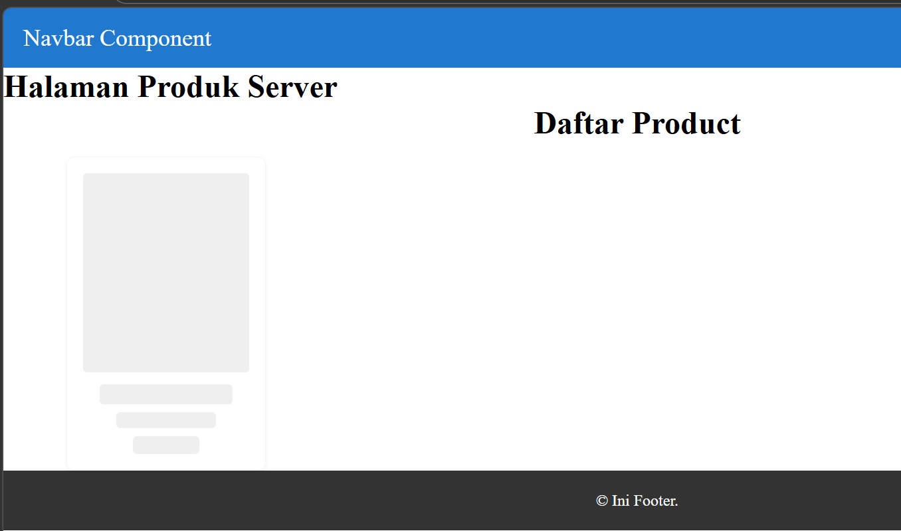
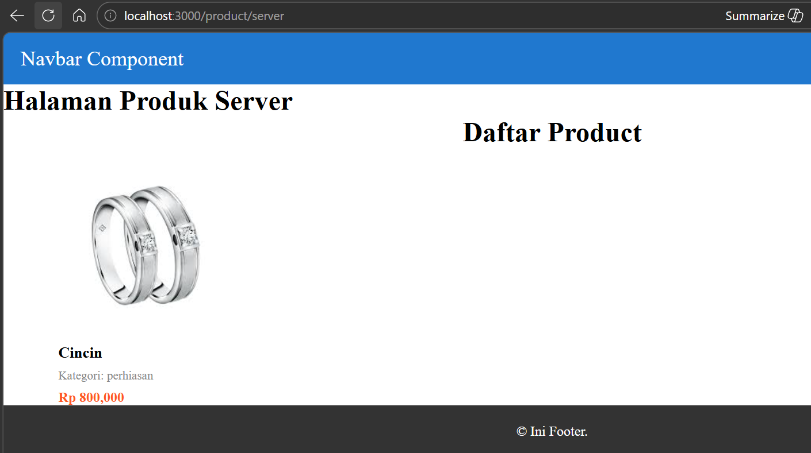
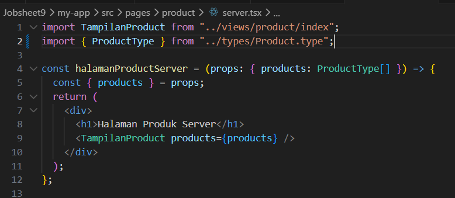
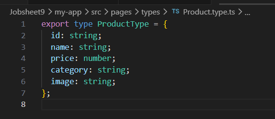
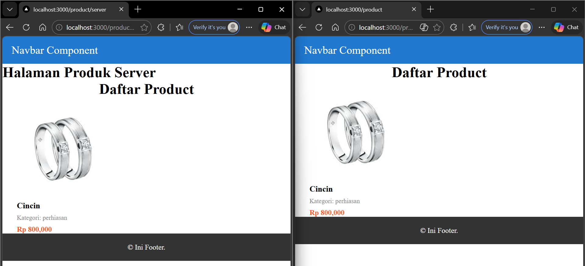

# Laporan Praktikum Jobsheet 09

## Identitas

- **Mata Kuliah**: Pemrograman Berbasis Framework
- **Program Studi**: Teknik Informatika
- **Semester**: 6
- **Praktikum**: Jobsheet 09
- **Nama**: Vincentius Leonanda Prabowo
- **NIM**: 2341720149
- **Kelas**: TI-3D

## Langkah 1 Setup Halaman SSR

## Langkah 2 Implementasi getServerSideProps pada server.tsx

## Langkah 3 Refactor Type

## Langkah 4 Uji Perbedaan CSR dan SSR

## Tugas

## Pertanyaan

### 1. Mengapa SSR lebih baik untuk SEO?

**Server-Side Rendering (SSR)** lebih baik untuk SEO karena halaman sudah dirender di server sebelum dikirim ke browser.
Ketika mesin pencari seperti Google melakukan crawling, mereka langsung menerima **HTML yang sudah berisi konten lengkap**.

Hal ini membuat:

- Konten lebih mudah diindeks oleh mesin pencari
- Struktur halaman lebih jelas untuk crawler
- Peringkat SEO dapat meningkat

---

### 2. Kapan sebaiknya menggunakan SSR?

SSR sebaiknya digunakan ketika:

- Website membutuhkan **SEO yang baik** (misalnya website perusahaan, blog, atau e-commerce).
- Data pada halaman harus **selalu terbaru setiap kali halaman dibuka**.
- Ingin **mempercepat tampilan awal halaman (initial load)** bagi pengguna.

Contoh penggunaan:

- Website berita
- Website perusahaan
- Halaman produk e-commerce

---

### 3. Apa kekurangan SSR dibanding CSR?

Beberapa kekurangan SSR dibanding **Client-Side Rendering (CSR)**:

- **Beban server lebih besar**, karena server harus merender halaman setiap ada request.
- **Waktu proses di server bisa lebih lama** jika banyak pengguna yang mengakses.
- **Implementasi lebih kompleks** dibandingkan CSR.

---

### 4. Mengapa skeleton tidak muncul pada SSR?

Skeleton biasanya digunakan untuk menampilkan **loading state** saat data sedang diambil di client.

Pada SSR:

- Data sudah **diambil dan dirender di server terlebih dahulu**.
- Ketika halaman dikirim ke browser, **konten sudah lengkap**.

Karena tidak ada proses loading di sisi client, maka **skeleton tidak sempat muncul**.
